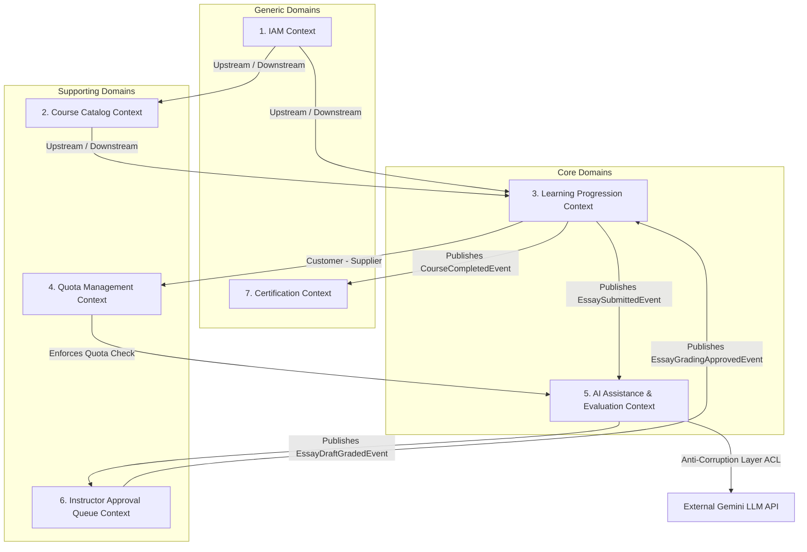

# THIẾT KẾ PHÂN RÃ HỆ THỐNG LMS THEO PHƯƠNG PHÁP LUẬN DOMAIN-DRIVEN DESIGN (DDD)
## MASTER OVERVIEW & CONTEXT MAP

---

## I. TỔNG QUAN HỆ THỐNG & ĐỊNH HƯỚNG TÁCH MODULAR

Hệ thống Quản lý Học tập Trực tuyến Tự học tích hợp Trợ lý AI được thiết kế theo phương pháp luận **Domain-Driven Design (DDD)** và kiến trúc **Microservices**. Để đảm bảo tính rõ ràng, mô hình hóa chính xác nghiệp vụ và tránh sự phức tạp của một tệp tài liệu duy nhất, toàn bộ thiết kế hệ thống được phân rã thành **7 tệp chuyên biệt tương ứng với từng Bounded Context**:

```
e:\TTTN\ddd_design\
├── 00_overview_and_context_map.md             <-- [FILE HIỆN TẠI] Tổng quan & Bản đồ Ngữ cảnh
├── 01_iam_context.md                          <-- Context 1: IAM (Xác thực & Phân quyền)
├── 02_course_catalog_context.md               <-- Context 2: Course Catalog & Mã kích hoạt
├── 03_learning_progression_context.md         <-- Context 3: Tiến trình học tuyến tính (DAG)
├── 04_quota_management_context.md             <-- Context 4: Quản lý Hạn ngạch AI (Quota Gateway)
├── 05_ai_assistance_evaluation_context.md    <-- Context 5: Trợ lý AI RAG & Chấm nháp tự luận
├── 06_instructor_approval_queue_context.md    <-- Context 6: Hàng đợi Duyệt điểm của Giảng viên
└── 07_certification_context.md                <-- Context 7: Phân hệ Cấp Chứng chỉ PDF
```

---

## II. PHÂN RÃ MIỀN NGHIỆP VỤ (DOMAIN DECOMPOSITION)

```
+-----------------------------------------------------------------------------+
|                                CORE DOMAIN                                  |
|  - Learning Progression Subdomain (Tiến trình học tuyến tính DAG)           |
|  - AI Assistance & Evaluation Subdomain (Trợ lý AI RAG & Chấm nháp tự luận)|
+-----------------------------------------------------------------------------+
|                             SUPPORTING DOMAIN                               |
|  - Access & Quota Control Subdomain (Cổng quản lý hạn ngạch API & kích hoạt)|
|  - Course Catalog & Knowledge Base Subdomain (Quản lý khóa học & Vector DB) |
|  - Instructor Approval Queue Subdomain (Hàng đợi kiểm duyệt của Giảng viên) |
+-----------------------------------------------------------------------------+
|                               GENERIC DOMAIN                                |
|  - Identity & Access Management - IAM Subdomain (Xác thực & Phân quyền)     |
|  - Certification Subdomain (Sinh chứng chỉ PDF ký số & Mã QR)               |
+-----------------------------------------------------------------------------+
```

---

## III. TỪ ĐIỂN NGÔN NGỮ CHUNG (UBIQUITOUS LANGUAGE)

| Thuật ngữ | Khái niệm Kỹ thuật / Nghiệp vụ tương ứng | Bounded Context áp dụng |
| :--- | :--- | :--- |
| **Learner** | Học viên tự nguyện đăng ký tự học | IAM, Learning Progression |
| **Enrollment** | Bản ghi đăng ký tham gia khóa học của học viên | Learning Progression |
| **DAG Node** | Nút bài học trong đồ thị lộ trình tiến trình tuyến tính | Learning Progression |
| **Message Quota** | Hạn ngạch số lượt tin nhắn AI được phép gửi trong chu kỳ | Quota Management |
| **Quota Gateway** | Cổng kiểm tra hạn ngạch trước khi chuyển tiếp yêu cầu đến AI Engine | Quota Management |
| **RAG Knowledge Chunk**| Đoạn văn bản tài liệu đã đánh chỉ mục Vector Embedding | AI Assistance |
| **Persona Mode** | Chế độ tương tác của AI (`Socratic` khơi gợi hoặc `Direct` trực tiếp) | AI Assistance |
| **Draft Grading** | Bản chấm nháp bài tự luận do AI thực hiện (`Draft_Graded`) | AI Assistance |
| **Approval Queue** | Hàng đợi bài làm tự luận chờ Giảng viên phê duyệt | Instructor Approval Queue |
| **Final Score** | Điểm số tự luận chính thức sau khi Giảng viên phê duyệt | Instructor Approval Queue |
| **Digital Certificate** | Chứng nhận hoàn thành khóa học dưới dạng file PDF có chữ ký số | Certification |

---

## IV. BẢN ĐỒ NGỮ CẢNH TỔNG THỂ (CONTEXT MAP)



---

## V. KIẾN TRÚC TỔNG THỂ C4 MODEL (CONTAINER DIAGRAM)

```mermaid
graph TD
    subgraph Client Layer
        SPA[React.js Web Client]
    end

    subgraph Gateway & Security Layer
        Gateway[API Gateway & Quota Gateway]
        Redis[(Redis Cache - Quota & Session)]
    end

    subgraph Microservices Layer (Bounded Contexts)
        Svc1[1. IAM Service]
        Svc2[2. Course Catalog Service]
        Svc3[3. Progression Service]
        Svc4[4. Quota Service]
        Svc5[5. AI Tutor & RAG Service]
        Svc6[6. Approval Queue Service]
        Svc7[7. Certification Service]
    end

    subgraph Storage & Messaging
        DB[(PostgreSQL Database)]
        VectorDB[(Qdrant Vector Database)]
        EventBus((RabbitMQ Event Bus))
    end

    SPA --> Gateway
    Gateway --> Redis
    Gateway --> Svc1 & Svc2 & Svc3 & Svc4 & Svc5 & Svc6 & Svc7
    Svc5 --> VectorDB
    Svc3 & Svc5 & Svc6 & Svc7 <--> EventBus
    Svc1 & Svc2 & Svc3 & Svc4 & Svc5 & Svc6 & Svc7 --> DB
```
