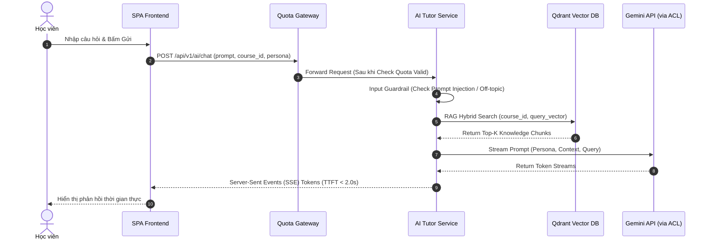

# BOUNDED CONTEXT 5: AI ASSISTANCE & EVALUATION CONTEXT
## Phân Tích & Thiết Kế Chi Tiết Trợ Lý AI RAG & Phân Hệ Chấm Nháp Bài Tự Luận

---

## I. MỤC TIÊU & PHẠM VI NGHIỆP VỤ
*   **Mục tiêu:** Xử lý hội thoại thông minh giữa Học viên và Trợ lý AI (hỏi đáp theo tài liệu đính kèm khóa học via RAG, chuyển đổi Persona `Socratic`/`Direct`), áp dụng bộ kiểm soát an toàn (Input/Output Guardrails), và tự động so khớp bài làm tự luận với Rubric để tạo bản chấm nháp (`Draft_Graded`).
*   **Phạm vi nghiệp vụ:** Phân tích câu hỏi, RAG Vector Search, Gọi LLM (Gemini API) qua tầng chống bóp méo (ACL), Kiểm tra Faithfulness, Chấm nháp tự luận, SSE Streaming phản hồi.

---

## II. THIẾT KẾ STRATEGIC & TACTICAL DDD

### 2.1 Aggregates

#### Aggregate 1: `AISession`
*   **Aggregate Root:** `AISession`
    *   *Entities:* `ChatMessage`
    *   *Value Objects:* `SessionId`, `LearnerId`, `CourseId`, `PersonaMode` (`SOCRATIC`, `DIRECT`), `PromptContext`.

#### Aggregate 2: `EssayEvaluation`
*   **Aggregate Root:** `EssayEvaluation`
    *   *Value Objects:* `EvaluationId`, `LearnerId`, `LessonId`, `StudentAnswer`, `AIDraftScore`, `AIDraftFeedback`, `DraftStatus` (`DRAFT_GRADED`).

---

## III. BỘ KIỂM SOÁT AN TOÀN AI (GUARDRAILS FRAMEWORK)

```
[User Question] ──► [Input Guardrail] ──► [RAG Search] ──► [LLM Streaming] ──► [Output Guardrail] ──► [SSE to Client]
                           │                                                          │
                           ▼ (Off-topic / Jailbreak)                                  ▼ (Faithfulness Failure)
                    [Chặn & Từ chối]                                           [Tự động Điều chỉnh / Retry]
```

### 3.1 Quy tắc Nghiệp vụ Đóng gói (Invariants):
1. **Bắt buộc liên kết RAG (BR-AI-01):** AI Tutor chỉ được lấy tri thức từ tài liệu thuộc đúng `course_id` trong Qdrant Vector DB.
2. **Quy tắc Socratic Mode (BR-AI-02):** Khi học viên chọn chế độ `Socratic`, AI không được cung cấp lời giải hoặc đoạn mã hoàn chỉnh, chỉ được đặt câu hỏi gợi mở từng bước.

---

## IV. ĐẶC TẢ API SPECIFICATION

| Method | Endpoint | Description | Auth Required | Payload / Response |
| :--- | :--- | :--- | :--- | :--- |
| `POST` | `/api/v1/ai/chat` | Gửi câu hỏi cho Trợ lý AI (Streaming phản hồi qua SSE) | Yes (LEARNER) | `{ prompt: "...", course_id: "UUID", persona: "SOCRATIC" \| "DIRECT" }` -> Response `text/event-stream` |
| `GET` | `/api/v1/ai/sessions/{session_id}/messages` | Xem lịch sử các tin nhắn trong phiên chat | Yes (LEARNER) | Returns Array of `ChatMessageDTO` |
| `POST` | `/api/v1/internal/ai/evaluate-essay` | Microservice gọi AI chấm nháp bài tự luận theo Rubric | Yes (INTERNAL API KEY) | `{ submission_id, lesson_id, student_answer }` -> Returns `{ ai_draft_score, ai_draft_feedback }` |
| `GET` | `/api/v1/admin/ai/guardrail-logs` | Admin xem nhật ký cảnh báo an toàn (Off-topic / Prompt Injection) | Yes (ADMIN) | Returns Array of `GuardrailViolationLogDTO` |

---

## V. SƠ ĐỒ LUỒNG CHAT SSE STREAMING & RAG (SEQUENCE DIAGRAM)



---

## VI. SỰ KIỆN MIỀN (DOMAIN EVENTS)
*   `EssayDraftGradedEvent`: Phát ra khi AI hoàn thành việc chấm nháp bài tự luận ngắn.
    *   *Payload:* `{ submission_id, learner_id, lesson_id, ai_draft_score, ai_draft_feedback }`
    *   *Consumer:* Instructor Approval Queue Context (để đẩy vào Hàng đợi chờ Giảng viên duyệt).
