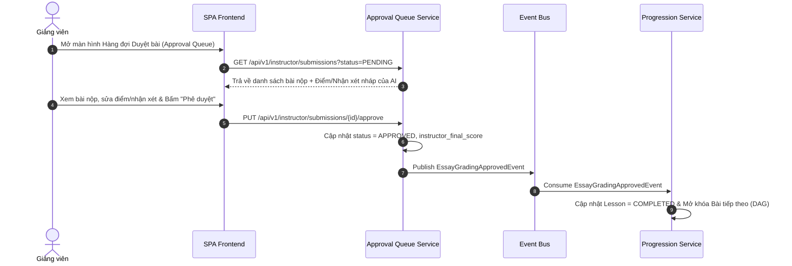

# BOUNDED CONTEXT 6: INSTRUCTOR APPROVAL QUEUE CONTEXT
## Phân Tích & Thiết Kế Chi Tiết Hàng Đợi Phê Duyệt Của Giảng Viên (Teacher-In-The-Loop)

---

## I. MỤC TIÊU & PHẠM VI NGHIỆP VỤ
*   **Mục tiêu:** Cung cấp quy trình kiểm duyệt điểm số bài tự luận do AI đề xuất, bảo đảm tính chính xác học thuật tối đa bằng cơ chế **Teacher-in-the-loop**.
*   **Phạm vi nghiệp vụ:** Tiếp nhận bản chấm nháp (`Draft_Graded`), hiển thị Hàng đợi Phê duyệt (Approval Queue) cho Giảng viên, hỗ trợ Giảng viên chỉnh sửa điểm số/nhận xét, bấm "Phê duyệt" để chốt điểm chính thức.

---

## II. THIẾT KẾ STRATEGIC & TACTICAL DDD

### 2.1 Aggregate Root: `GradingSubmission`

```
[GradingSubmission Aggregate Root]
  └── Value Objects:
       ├── SubmissionId (UUID)
       ├── EnrollmentId (UUID)
       ├── LessonId (UUID)
       ├── StudentAnswer (Text)
       ├── AIDraftScore (Decimal)
       ├── AIDraftFeedback (Text)
       ├── InstructorFinalScore (Decimal)
       ├── InstructorFeedback (Text)
       └── ApprovalStatus (PENDING, APPROVED, REJECTED)
```

### 2.2 Quy tắc Đóng gói (Invariants):
1. **Chốt chặn Phê duyệt của Giảng viên (BR-AI-03):** Điểm tự luận do AI chấm nháp (`AIDraftScore`) không tự động có hiệu lực. Điểm số chỉ trở thành điểm chính thức và trigger mở khóa bài tiếp theo khi trạng thái chuyển sang `APPROVED` bởi Giảng viên.

---

## III. DDL CƠ SỞ DỮ LIỆU (POSTGRESQL SCHEMA)

```sql
-- Bảng Hàng đợi Phê duyệt bài tự luận (Instructor Queue Context)
CREATE TABLE grading_submissions (
    submission_id UUID PRIMARY KEY DEFAULT gen_random_uuid(),
    enrollment_id UUID NOT NULL,
    lesson_id UUID NOT NULL,
    student_answer TEXT NOT NULL,
    ai_draft_score DECIMAL(4,2),
    ai_draft_feedback TEXT,
    instructor_final_score DECIMAL(4,2),
    instructor_feedback TEXT,
    approval_status VARCHAR(20) DEFAULT 'PENDING' CHECK (approval_status IN ('PENDING', 'APPROVED', 'REJECTED')),
    submitted_at TIMESTAMP WITH TIME ZONE DEFAULT CURRENT_TIMESTAMP,
    approved_at TIMESTAMP WITH TIME ZONE
);

CREATE INDEX idx_grading_submissions_status ON grading_submissions(approval_status);
```

---

## IV. ĐẶC TẢ API SPECIFICATION

| Method | Endpoint | Description | Auth Required | Payload / Response |
| :--- | :--- | :--- | :--- | :--- |
| `GET` | `/api/v1/instructor/submissions` | Giảng viên xem danh sách các bài nộp tự luận cần duyệt | Yes (INSTRUCTOR) | Query params `status=PENDING` -> Returns Array of `SubmissionSummaryDTO` |
| `GET` | `/api/v1/instructor/submissions/{submission_id}` | Xem chi tiết bài nộp tự luận & nhận xét nháp của AI | Yes (INSTRUCTOR) | Returns `SubmissionDetailDTO` |
| `PUT` | `/api/v1/instructor/submissions/{submission_id}/approve` | Giảng viên duyệt điểm chính thức & gửi nhận xét cuối cùng | Yes (INSTRUCTOR) | `{ final_score: 8.5, instructor_feedback: "Bài viết tốt, đã sửa lỗi nhỏ...", status: "APPROVED" }` |
| `PUT` | `/api/v1/instructor/submissions/{submission_id}/reject` | Giảng viên yêu cầu học viên làm lại bài | Yes (INSTRUCTOR) | `{ instructor_feedback: "Bài làm chưa đạt yêu cầu...", status: "REJECTED" }` |

---

## V. SƠ ĐỒ LUỒNG PHÊ DUYỆT ĐIỂM (SEQUENCE DIAGRAM)



---

## VI. SỰ KIỆN MIỀN (DOMAIN EVENTS)
*   `EssayGradingApprovedEvent`: Phát ra khi Giảng viên bấm phê duyệt bài tự luận.
    *   *Consumer:* Learning Progression Context (để tính toán GPA và mở khóa bài tiếp theo).
