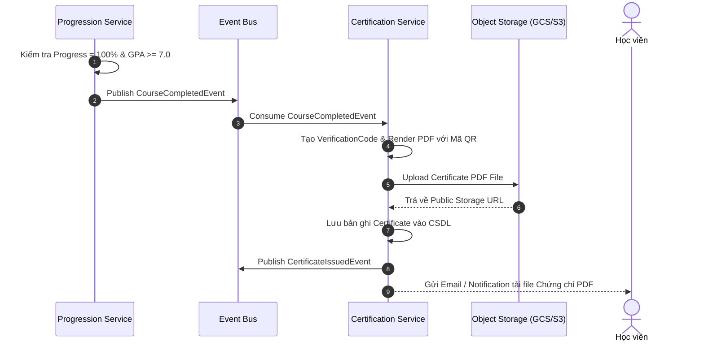

# BOUNDED CONTEXT 7: CERTIFICATION CONTEXT (PHÂN HỆ PHỤ)
## Phân Tích & Thiết Kế Chi Tiết Phân Hệ Cấp Chứng Chỉ Số PDF

---

## I. MỤC TIÊU & PHẠM VI NGHIỆP VỤ
*   **Mục tiêu:** Tự động tạo và quản lý chứng nhận hoàn thành khóa học dưới dạng file PDF có mã QR xác thực và chữ ký số khi học viên thỏa mãn đầy đủ các điều kiện tốt nghiệp.
*   **Phạm vi nghiệp vụ:** Lắng nghe sự kiện hoàn thành khóa học, kiểm tra tiêu chuẩn $GPA \ge 7.0/10.0$, sinh mã xác thực duy nhất (`VerificationCode`), render file PDF chứng chỉ, lưu trữ lên Object Storage và gửi thông báo cho học viên.

---

## II. THIẾT KẾ STRATEGIC & TACTICAL DDD

### 2.1 Aggregate Root: `Certificate`

```
[Certificate Aggregate Root]
  └── Value Objects:
       ├── CertificateId (UUID)
       ├── EnrollmentId (UUID)
       ├── LearnerId (UUID)
       ├── CourseId (UUID)
       ├── VerificationCode (String)
       ├── FinalGPA (Decimal >= 7.0)
       ├── PdfStorageUrl (URL)
       └── IssuedAt (Timestamp)
```

### 2.2 Quy tắc Đóng gói (Invariants):
1. **Tiêu chuẩn Cấp Chứng chỉ (BR-LMS-04):** Tự động sinh chứng chỉ PDF chỉ khi Tiến độ hoàn thành khóa học đạt 100% và Điểm trung bình tích lũy $GPA \ge 7.0/10.0$.
2. Mỗi bản ghi `Enrollment` chỉ được cấp tối đa 1 chứng chỉ duy nhất (`Unique EnrollmentId`).

---

## III. DDL CƠ SỞ DỮ LIỆU (POSTGRESQL SCHEMA)

```sql
-- Bảng Chứng chỉ (Certification Context)
CREATE TABLE certificates (
    certificate_id UUID PRIMARY KEY DEFAULT gen_random_uuid(),
    enrollment_id UUID UNIQUE NOT NULL,
    verification_code VARCHAR(100) UNIQUE NOT NULL,
    final_gpa DECIMAL(3,2) NOT NULL CHECK (final_gpa >= 7.0),
    pdf_url VARCHAR(500) NOT NULL,
    issued_at TIMESTAMP WITH TIME ZONE DEFAULT CURRENT_TIMESTAMP
);

CREATE INDEX idx_certificates_verification ON certificates(verification_code);
```

---

## IV. ĐẶC TẢ API SPECIFICATION

| Method | Endpoint | Description | Auth Required | Payload / Response |
| :--- | :--- | :--- | :--- | :--- |
| `GET` | `/api/v1/certificates/my-certificates` | Học viên xem danh sách các chứng chỉ số đã nhận | Yes (LEARNER) | Returns Array of `CertificateDTO` |
| `GET` | `/api/v1/certificates/verify/{verification_code}` | Công khai tra cứu & xác thực tính hợp lệ của chứng chỉ | No | Returns `CertificateVerificationDTO` |
| `GET` | `/api/v1/certificates/{certificate_id}/download` | Tải xuống file PDF chứng chỉ hoàn thành | Yes (LEARNER) | Returns PDF File Stream (`application/pdf`) |

---

## V. SƠ ĐỒ LUỒNG TỰ ĐỘNG CẤP CHỨNG CHỈ (SEQUENCE DIAGRAM)



---

## VI. SỰ KIỆN MIỀN (DOMAIN EVENTS)
*   `CertificateIssuedEvent`: Phát ra khi chứng chỉ số được sinh thành công.
