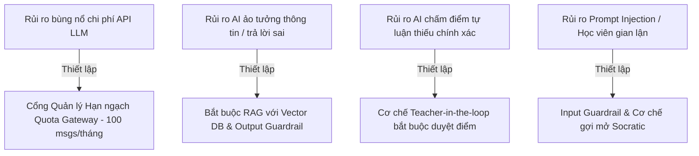

# TÀI LIỆU PHÂN TÍCH NGHIỆP VỤ HỆ THỐNG QUẢN LÝ HỌC TẬP TRỰC TUYẾN TỰ HỌC THEO TIẾN ĐỘ CÁ NHÂN TÍCH HỢP TRỢ LÝ AI THEO CHUẨN BABOK® v3

---

## CHƯƠNG I: TỔNG QUAN VÀ KHUNG KHÁI NIỆM CỐT LÕI (BACCM™)

### 1.1 Tổng quan về Hệ thống Nghiệp vụ
Tài liệu này đóng vai trò là Báo cáo Phân tích Nghiệp vụ (Business Analysis Specification Report) chính thức cho **Hệ thống Quản lý Học tập Trực tuyến Tự học theo Tiến độ Cá nhân Tích hợp Trợ lý AI (AI-First Self-paced LMS)**. Tài liệu được cấu trúc tuân thủ chặt chẽ theo các Vùng tri thức (Knowledge Areas) tiêu chuẩn của **BABOK® v3 (Business Analysis Body of Knowledge - IIBA®)**.

Hệ thống hướng tới giải quyết các vấn đề cốt lõi của mô hình tự học tự nguyện:
*   Người học thiếu người hỗ trợ giải đáp tức thì 24/7 khi gặp kiến thức khó.
*   Bài tập tự luận ngắn đòi hỏi tư duy sâu bị nghẽn do thời gian chấm bài thủ công của giảng viên trễ từ 3-7 ngày.
*   Tỷ lệ hoàn thành các khóa tự học truyền thống rất thấp (<10%).
*   Rủi ro bùng nổ chi phí hạ tầng API LLM nếu không có cơ chế quản lý hạn ngạch truy vấn nghiêm ngặt.

### 1.2 Khung Khái niệm Cốt lõi của BABOK® (BACCM™ Framework)

Mô hình BACCM™ (Business Analysis Core Concept Model) định hình giải pháp nghiệp vụ chính như sau:

| Khái niệm BACCM | Chi tiết Mô tả Giải pháp Hệ thống (AI-First Self-paced LMS) |
| :--- | :--- |
| **Change (Sự thay đổi)** | Chuyển đổi mô hình tự học truyền thống thụ động thành nền tảng tự học tương tác thông minh tích hợp Trợ lý AI đồng hành 24/7, tự động hóa chấm nháp bài tự luận ngắn, quản lý tiến trình theo đồ thị tuyến tính (DAG) và kiểm soát hạn ngạch API tài nguyên AI theo từng phân cấp người dùng. |
| **Need (Nhu cầu)** | **Học viên:** Cần giải đáp thắc mắc tức thì 24/7, nhận phản hồi bài tự luận nhanh để điều chỉnh kiến thức, được theo dõi tiến độ rõ ràng và nhận chứng chỉ hoàn thành.<br>**Giảng viên:** Cần công cụ quản lý khóa học thông minh, tự động hóa 80% khối lượng chấm bài tự luận sơ bộ.<br>**Doanh nghiệp/Admin:** Cần kiểm soát rủi ro chi phí tài nguyên hạ tầng LLM và đảm bảo an toàn học thuật. |
| **Solution (Giải pháp)** | Phân hệ LMS tự học tuyến tính tích hợp Trợ lý AI RAG đa Persona (`Socratic` khơi gợi tư duy / `Direct` tra cứu nhanh), Cổng Quản lý Hạn ngạch AI (Quota Gateway), Hàng đợi Phê duyệt của Giảng viên (Teacher Approval Queue), và Hệ thống Tự động Cấp Chứng chỉ PDF. |
| **Stakeholders (Bên liên quan)** | Học viên tự nguyện tự học (Self-paced Learner), Giảng viên / Người biên soạn học liệu (Instructor / Content Author), Quản trị viên hệ thống (System Administrator). |
| **Value (Giá trị)** | **Học viên:** Chủ động tốc độ học, lấp đầy lỗ hổng kiến thức, tăng động lực hoàn thành khóa học và sở hữu chứng chỉ số uy tín.<br>**Giảng viên:** Tối ưu hóa thời gian chấm bài, nâng cao chất lượng học liệu.<br>**Hệ thống:** Tối ưu hóa hiệu suất vận hành, kiểm soát 100% rủi ro trần chi phí API LLM. |
| **Context (Bối cảnh)** | Nhu cầu tự học, tự nâng cao kỹ năng ngoài giờ chính khóa ngày càng phát triển; hạ tầng điện toán AI đòi hỏi sự phân bổ tài nguyên hợp lý dựa trên định mức ngân sách. |

---

## CHƯƠNG II: LÊN KẾ HOẠCH VÀ GIÁM SÁT PHÂN TÍCH NGHIỆP VỤ (BABOK® Chapter 3)

### 2.1 Tiếp cận Phân tích Nghiệp vụ (Business Analysis Approach)
*   **Phương pháp:** Kết hợp giữa *Predictive (Thiết kế hệ thống theo chuẩn mực)* và *Adaptive (Phát triển Agile/Scrum)*.
*   **Cơ chế bàn giao:** Phân rã hệ thống thành các Microservices độc lập theo phương pháp luận Domain-Driven Design (DDD) để sẵn sàng triển khai từng phân hệ chức năng.

### 2.2 Kế hoạch Tương tác với Bên liên quan (Stakeholder Engagement Plan)

| Nhóm Stakeholder | Quyền hạn / Vai trò | Tần suất & Phương thức Tương tác | Mục tiêu Tương tác |
| :--- | :--- | :--- | :--- |
| **Học viên Tự học (Learners)** | Người dùng cuối | Khảo sát nhu cầu (Survey), Kiểm thử người dùng (Usability Testing) | Đánh giá trải nghiệm tương tác với AI Tutor, đo lường chỉ số hài lòng CSAT |
| **Giảng viên (Instructors)** | Người duyệt điểm & tạo học liệu | Workshop thảo luận, Khảo sát quy trình chấm bài | Chuẩn hóa Rubric chấm tự luận và tối ưu giao diện Approval Queue |
| **System Admin** | Quản trị hạ tầng & Chi phí | Phỏng vấn chuyên sâu (Interview), Đánh giá chỉ số hạ tầng | Xác định định mức Message Quota (100 msgs/tháng) và cấu hình Guardrails |

### 2.3 Quản lý Thông tin Phân tích Nghiệp vụ & Vòng đời Yêu cầu
*   Toàn bộ đặc tả yêu cầu được truy vết hai chiều (Bidirectional Traceability) thông qua Ma trận Truy vết Yêu cầu (RTM).
*   Mọi thay đổi yêu cầu nghiệp vụ phải trải qua quy trình đánh giá tác động (Impact Analysis) và phê duyệt từ Trưởng nhóm Nghiệp vụ (Lead BA).

---

## CHƯƠNG III: KHỞI GỌI VÀ HỢP TÁC (BABOK® Chapter 4)

### 3.1 Kỹ thuật Khơi gợi Yêu cầu (Elicitation Techniques Applied)
1.  **Phân tích Tài liệu (Document Analysis):** Phân tích các tiêu chuẩn LMS phổ biến (SCORM/xAPI) và quy trình chấm bài tự luận theo Rubric.
2.  **Phỏng vấn Chuyên sâu (Interviews):** Phỏng vấn giảng viên để trích xuất quy tắc chấm bài tự luận và cách xử lý khi học viên hỏi câu hỏi lạc đề.
3.  **Hội thảo Nghiệp vụ (Workshops):** Tổ chức hội thảo với chuyên gia AI để xác định ngưỡng an toàn (Safety Thresholds) và kỹ thuật RAG chống ảo tưởng thông tin.

### 3.2 Kết quả Khơi gợi Yêu cầu & Đồng thuận (Elicitation Confirmation)
*   Thống nhất 100% quy trình chấm bài tự luận bắt buộc có bước **Giảng viên kiểm duyệt (Teacher-in-the-loop)** trước khi công nhận điểm số chính thức.
*   Thống nhất cơ chế kiểm soát hạn ngạch: Mỗi tài khoản tiêu chuẩn được cấp **100 lượt truy vấn AI/tháng**. Khi dùng hết, hệ thống tự động khóa tính năng gửi câu hỏi đến chu kỳ tiếp theo.

---

## CHƯƠNG IV: PHÂN TÍCH CHIẾN LƯỢC (Strategy Analysis - BABOK® Chapter 6)

### 4.1 Phân tích Trạng thái Hiện tại (Analyze Current State)
*   **Điểm yếu hệ thống tự học truyền thống:**
    *   *Tỷ lệ hoàn thành cực thấp:* Dưới 10% người học hoàn thành khóa tự học do cảm giác cô đơn và không được giải đáp thắc mắc kịp thời.
    *   *Trễ hạn đánh giá tự luận:* Bài tập tự luận ngắn/thực hành mất từ 3 đến 7 ngày để giảng viên phản hồi, làm đứt gãy luồng học tập cá nhân.
    *   *Không kiểm soát chi phí tính toán:* Chưa có giải pháp tích hợp AI vừa đảm bảo hỗ trợ 24/7 vừa kiểm soát chi phí token API.

### 4.2 Định nghĩa Trạng thái Tương lai (Define Future State & SMART Goals)
Hệ thống **AI-First LMS** hướng tới các mục tiêu cụ thể:
1.  **Tăng Tỷ lệ Hoàn thành (CCR):** Đạt tối thiểu **35%** người học hoàn thành khóa học trong 6 tháng.
2.  **Tối ưu Thời gian Đánh giá Tự luận:** Giảm thời gian học viên nhận kết quả chấm tự luận từ 3-7 ngày xuống **dưới 5 phút** (AI chấm nháp tức thì, giảng viên duyệt nhanh trong hàng đợi).
3.  **Tốc độ Phản hồi AI (TTFT):** Thời gian phản hồi từ đầu tiên của AI Tutor **$< 2.0$ giây** qua kết nối Server-Sent Events (SSE).
4.  **Kiểm soát 100% Chi phí Hạ tầng AI:** 100% các phiên tương tác AI được kiểm soát qua Cổng Quản lý Hạn ngạch Quota Gateway.

### 4.3 Phân tích Rủi ro & Chiến lược Giảm thiểu (Risk Assessment)



---

## CHƯƠNG V: PHÂN TÍCH YÊU CẦU & ĐẶC TẢ THIẾT KẾ (Requirements Analysis & Design Definition - BABOK® Chapter 7)

### 5.1 Kiến thức Nền tảng Kỹ thuật Hệ thống
Hệ thống được thiết kế dựa trên các nền tảng công nghệ và kiến trúc tiên tiến:
*   **Tổng quan LMS Tự học:** Tổ chức theo cây Cấu trúc Khóa học ──► Chương/Phần ──► Bài học. Tiến trình học được kiểm soát nghiêm ngặt theo Đồ thị có hướng không chu trình (DAG).
*   **Kiến trúc Web & Tech Stack:** Client React.js/Vite giao tiếp với Backend Microservices (Node.js/FastAPI) qua REST API và SSE Streaming. CSDL kết hợp PostgreSQL (dữ liệu quan hệ) và Qdrant (Vector Database cho RAG).
*   **Generative AI & LLM Integration:** Sử dụng Google Gemini 1.5 Flash (tra cứu nhanh) và Gemini 1.5 Pro (chấm nháp tự luận).
*   **Kiến trúc RAG (Retrieval-Augmented Generation):** Trích xuất thông tin tự động từ file bài giảng đính kèm, tạo Vector Embedding (`text-embedding-004`) để cung cấp ngữ cảnh chính xác cho LLM.
*   **AI Safety & Guardrails:** Tầng kiểm soát an toàn kép (Input Guardrail lọc câu hỏi ngoài lề/Prompt Injection; Output Guardrail kiểm tra độ trung thực Faithfulness và trích dẫn nguồn).

### 5.2 Đặc tả Yêu cầu Đối tượng Sử dụng (Stakeholder Requirements - UR)

#### A. Học viên Tự học (Learners)
*   **UR-LN-01:** Tôi muốn dễ dàng đăng ký khóa học và kích hoạt tài khoản thông qua Mã kích hoạt (Activation Code) để bắt đầu học ngay.
*   **UR-LN-02:** Tôi muốn xem video bài giảng và được hệ thống tự động theo dõi % thời lượng xem để mở khóa bài tiếp theo.
*   **UR-LN-03:** Tôi muốn hỏi đáp 24/7 với Trợ lý AI và có thể chuyển đổi linh hoạt giữa chế độ `Socratic` (gợi ý tư duy) và `Direct` (giải thích trực tiếp).
*   **UR-LN-04:** Tôi muốn nộp bài tập tự luận ngắn và nhận được nhận xét/điểm số đề xuất từ AI tức thì, sau đó nhận kết quả phê duyệt chính thức từ giảng viên.
*   **UR-LN-05:** Tôi muốn nhận chứng chỉ PDF ký số khi hoàn thành 100% bài học và đạt $GPA \ge 7.0/10.0$.

#### B. Giảng viên / Người biên soạn (Instructors)
*   **UR-IS-01:** Tôi muốn thiết kế bài học theo tuyến tính DAG và nạp tài liệu đính kèm (PDF/Word) để tạo cơ sở tri thức cho AI Tutor của khóa học.
*   **UR-IS-02:** Tôi muốn sử dụng tính năng AI chấm nháp bài tự luận của học viên để giảm thời gian chấm bài.
*   **UR-IS-03:** Tôi muốn có màn hình Hàng đợi Phê duyệt (Approval Queue) để xem điểm/nhận xét nháp của AI, chỉnh sửa nếu cần và bấm nút phê duyệt chính thức.

#### C. Quản trị viên (Administrators)
*   **UR-AD-01:** Tôi muốn quản lý danh mục khóa học, người dùng và mã kích hoạt.
*   **UR-AD-02:** Tôi muốn theo dõi báo cáo lưu lượng truy vấn AI, quản lý định mức Quota và cấu hình bộ lọc an toàn Guardrails.

### 5.3 Đặc tả Yêu cầu Chức năng (Functional Requirements - FR)

```
                       [KIẾN TRÚC NGHIỆP VỤ HỆ THỐNG]
                       
   +-------------------------------------------------------------+
   |                  Giao Diện Người Dùng (UI)                  |
   |   - Luồng học tuyến tính DAG    - Form Đăng ký / Kích hoạt   |
   |   - Khung chat AI đa Persona   - Dashboard Giảng viên duyệt  |
   +------------------------------+------------------------------+
                                  |
                                  v
   +-------------------------------------------------------------+
   |                Cổng Quản Lý Hạn Ngạch Tài Nguyên            |
   |                     (Quota Gateway API)                     |
   |   - Kiểm tra định mức truy vấn AI còn lại của tài khoản     |
   |   - Trừ lượt hạn ngạch (mặc định 100 msgs/tháng)            |
   +------------------------------+------------------------------+
                                  |
                                  v
   +-------------------------------------------------------------+
   |                    AI Tutor Engine & RAG                    |
   |   - RAG Search: Chỉ truy xuất tri thức khóa học (VectorDB)  |
   |   - Persona Switcher: Gợi mở (Socratic) / Trực tiếp (Direct) |
   |   - Chấm nháp tự luận dựa trên Rubric chuẩn                 |
   |   - Bộ lọc Input / Output Guardrails (Safety & Faithfulness)|
   +-------------------------------------------------------------+
```

#### Phân hệ 1: Quản lý Tài khoản & Phân quyền (IAM)
*   **FR-IAM-01:** Đăng ký, đăng nhập bảo mật qua JWT Token; phân quyền theo Role (`LEARNER`, `INSTRUCTOR`, `ADMIN`).
*   **FR-IAM-02:** Quản lý thông tin hồ sơ cá nhân và đổi mật khẩu.

#### Phân hệ 2: Quản lý Khóa học, Học liệu & Mã Kích hoạt (Catalog Context)
*   **FR-CAT-01:** Quản lý cây danh mục khóa học, thông tin tổng quan và xem trước bài giảng.
*   **FR-CAT-02 (Mã kích hoạt):** Sinh và quản lý danh sách Mã kích hoạt (`ActivationCode`) để người học tự mở khóa học.
*   **FR-CAT-03 (Quản lý Học liệu RAG):** Cho phép Giảng viên tải lên tài liệu đính kèm (PDF, DOCX). Hệ thống tự động chia nhỏ (Chunking) và tạo chỉ mục Vector Embeddings trong Vector Database.

#### Phân hệ 3: Lộ trình Tuyến tính DAG & Quản lý Tiến độ (Progression Core)
*   **FR-PRG-01 (Mở khóa Tuyến tính DAG):** Hệ thống bắt buộc bài học $N+1$ chỉ được mở khóa khi Bài học $N$ có trạng thái `COMPLETED` (BR-LMS-03).
*   **FR-PRG-02 (Giám sát Video):** Ghi nhận trạng thái hoàn thành bài học video khi học viên xem đạt tối thiểu $90\%$ tổng thời lượng.
*   **FR-PRG-03 (Theo dõi Kết quả Học tập):** Tính toán và hiển thị % tiến độ khóa học, GPA tích lũy và lịch sử học tập.

#### Phân hệ 4: Cổng Quản lý Hạn ngạch AI (Quota Gateway)
*   **FR-QUO-01 (Quản lý Hạn ngạch Message AI):**
    *   Mỗi tài khoản học viên tiêu chuẩn có hạn ngạch tối đa 100 tin nhắn AI/tháng (BR-COM-01).
    *   Cổng Quota Gateway kiểm tra số lượt khả dụng trước khi gọi API LLM. Khi đạt 100%, tạm khóa nút gửi câu hỏi và hiển thị thông báo chờ chu kỳ mới.

#### Phân hệ 5: Trợ lý AI Hỗ trợ Học tập & RAG Engine
*   **FR-AIE-01 (RAG Truy xuất Tri thức):** AI Tutor chỉ truy xuất thông tin từ tài liệu đính kèm của khóa học tương ứng trong Vector DB để trả lời câu hỏi (BR-AI-01).
*   **FR-AIE-02 (Persona Switcher):** Người học có thể tùy chọn chế độ tương tác:
    *   `Socratic`: Chỉ đưa ra câu hỏi gợi mở, hướng dẫn tư duy từng bước, không cung cấp đáp án/mã nguồn hoàn chỉnh (BR-AI-02).
    *   `Direct`: Giải đáp trực tiếp, trích dẫn chính xác tài liệu tham khảo.
*   **FR-AIE-03 (AI Chấm nháp Bài tự luận):** Khi học viên nộp bài tự luận ngắn, AI tự động so khớp với Rubric chấm điểm, sinh điểm số đề xuất và nhận xét chi tiết, lưu bản ghi ở trạng thái `Draft_Graded` và đẩy vào Hàng đợi Kiểm duyệt.

#### Phân hệ 6: Hàng đợi Kiểm duyệt của Giảng viên (Instructor Approval Queue)
*   **FR-TCH-01 (Màn hình Duyệt bài):** Cung cấp giao diện Hàng đợi Phê duyệt cho Giảng viên. Giảng viên xem bài làm, kết quả chấm nháp của AI, có quyền điều chỉnh điểm số/nhận xét và bấm "Phê duyệt" (`Approved`) để công bố kết quả chính thức cho học viên (BR-AI-03).

#### Phân hệ 7: Cơ chế Kiểm soát An toàn (Guardrails Framework)
*   **FR-SAF-01 (Input Guardrail):** Chặn đứng các câu hỏi Prompt Injection, Jailbreak và câu hỏi lạc đề không thuộc phạm vi học thuật của khóa học.
*   **FR-SAF-02 (Output Guardrail & Faithfulness):** Kiểm tra độ trung thực của câu trả lời AI so với tài liệu gốc, bắt buộc trích dẫn nguồn (Citation).

#### Phân hệ 8: Hệ thống Tự động Cấp Chứng nhận PDF (Certification)
*   **FR-CRT-01 (Sinh Chứng chỉ PDF):** Tự động tạo file PDF chứng chỉ hoàn thành có mã QR xác thực và chữ ký số khi học viên đạt 100% tiến độ và $GPA \ge 7.0/10.0$ (BR-LMS-04).

---

### 5.4 Đặc tả Yêu cầu Phi Chức năng (Non-Functional Requirements - NFR)
*   **NFR-LAT-01 (Độ trễ Phản hồi):** Thời gian phản hồi từ đầu tiên (Time to First Token - TTFT) của AI Tutor phải dưới **2.0 giây** thông qua cơ chế streaming Server-Sent Events (SSE).
*   **NFR-ACC-01 (Độ chính xác Chấm nháp):** Điểm số bài tự luận do AI đề xuất đạt độ tương đồng $\ge 90\%$ so với điểm phê duyệt cuối cùng của giảng viên (dung sai $\pm 1.0$ điểm trên thang 10).
*   **NFR-SEC-01 (Bảo mật & Quyền riêng tư):** Mã hóa toàn bộ dữ liệu truyền tải qua HTTPS. Quyền riêng tư lịch sử chat và bài nộp được bảo vệ nghiêm ngặt giữa các tài khoản.
*   **NFR-SCA-01 (Khả năng Mở rộng Hạ tầng):** Hệ thống hỗ trợ tối thiểu 1,000 phiên chat AI đồng thời mà không bị sập ngắt kết nối.

---

### 5.5 Phân tích Quy tắc Nghiệp vụ Hệ thống (Business Rules - BR)

| Mã Quy tắc | Tên Quy tắc Nghiệp vụ | Nội dung Chi tiết Quy tắc | Phân hệ Áp dụng |
| :--- | :--- | :--- | :--- |
| **BR-COM-01** | Hạn ngạch tin nhắn AI | Tài khoản học viên tiêu chuẩn có tối đa 100 lượt chat AI/tháng. Đạt trần sẽ tạm khóa nút gửi câu hỏi. | Quota Gateway |
| **BR-AI-01** | Bắt buộc liên kết RAG | AI Tutor chỉ truy xuất và trả lời dựa trên kho tri thức đính kèm khóa học trong Vector DB. | AI Tutor Engine |
| **BR-AI-02** | Phương pháp Socratic | Ở chế độ `Socratic`, AI không được đưa đáp án/mã nguồn hoàn chỉnh, chỉ được đặt câu hỏi gợi mở. | AI Tutor Engine |
| **BR-AI-03** | Chốt chặn Giảng viên | Điểm tự luận do AI chấm nháp (`Draft_Graded`) chỉ có hiệu lực mở khóa bài học sau khi Giảng viên duyệt (`Approved`). | Approval Queue |
| **BR-LMS-03** | Khóa Tiến trình Tuyến tính | Bài học $N+1$ chỉ mở khóa khi Bài học $N$ đạt trạng thái `COMPLETED` trong đồ thị DAG. | LMS Core |
| **BR-LMS-04** | Tiêu chuẩn Cấp Chứng chỉ | Tự động sinh chứng chỉ PDF khi Tiến độ học = 100% và Điểm tích lũy tích lũy $GPA \ge 7.0/10.0$. | Certification |

---

## CHƯƠNG VI: QUẢN LÝ VÒNG ĐỜI YÊU CẦU (BABOK® Chapter 5)

### 6.1 Ma trận Truy vết Yêu cầu (Requirements Traceability Matrix - RTM)

| Mã Yêu cầu Doanh nghiệp | Yêu cầu Stakeholder (UR) | Yêu cầu Chức năng (FR) | Quy tắc Nghiệp vụ (BR) | Phân hệ Triển khai |
| :--- | :--- | :--- | :--- | :--- |
| **BR-SYS-01** (Kiểm soát chi phí & tài nguyên hạ tầng) | **UR-LN-01** (Kích hoạt khóa học) | **FR-CAT-02** (Mã kích hoạt)<br>**FR-QUO-01** (Quản lý Quota) | **BR-COM-01** (Hạn ngạch 100 msgs) | Access & Quota Gateway |
| **BR-SYS-02** (Tối ưu hóa quy trình đánh giá bài tự luận) | **UR-LN-04** (Nhận nhận xét tự luận nhanh)<br>**UR-IS-03** (Giảng viên kiểm duyệt) | **FR-AIE-03** (AI chấm nháp)<br>**FR-TCH-01** (Hàng đợi kiểm duyệt) | **BR-AI-03** (Chốt chặn Giảng viên) | AI Grading & Approval Queue |
| **BR-SYS-03** (Đảm bảo chất lượng hỗ trợ AI & An toàn) | **UR-LN-03** (Hỏi đáp AI 24/7)<br>**UR-IS-01** (Nạp học liệu RAG) | **FR-AIE-01** (RAG Search)<br>**FR-AIE-02** (Persona Switcher)<br>**FR-SAF-01** (Guardrails) | **BR-AI-01** (Bắt buộc RAG)<br>**BR-AI-02** (Quy tắc Socratic) | AI Tutor Engine |
| **BR-SYS-04** (Tự động hóa tiến trình học tập & Chứng chỉ) | **UR-LN-02** (Học tuyến tính)<br>**UR-LN-05** (Nhận chứng chỉ số) | **FR-PRG-01** (Mở khóa DAG)<br>**FR-PRG-02** (Giám sát video)<br>**FR-CRT-01** (Chứng chỉ PDF) | **BR-LMS-03** (Khóa DAG)<br>**BR-LMS-04** (Tiêu chuẩn Chứng chỉ) | LMS Core & Certification |

### 6.2 Ưu tiên Yêu cầu (MoSCoW Prioritization)
*   **MUST HAVE (Bắt buộc phải có):** Xem bài giảng video & mở khóa tiến trình DAG (FR-PRG-01), Hỏi đáp AI RAG giới hạn theo khóa học (FR-AIE-01), Cổng quản lý hạn ngạch Quota Gateway (FR-QUO-01), AI chấm nháp bài tự luận & Hàng đợi kiểm duyệt của Giảng viên (FR-AIE-03, FR-TCH-01).
*   **SHOULD HAVE (Nên có):** Chuyển đổi Persona AI (`Socratic` vs `Direct`) (FR-AIE-02), Tự động sinh và cấp chứng chỉ PDF có QR code (FR-CRT-01), Bộ lọc an toàn Guardrails (FR-SAF-01).
*   **COULD HAVE (Có thể có):** AI tự động gợi ý tài liệu học thêm dựa trên lịch sử hỏi đáp, Diễn đàn thảo luận tự học.
*   **WON'T HAVE (Chưa triển khai):** Chấm bài tự luận bằng giọng nói/video.

---

## CHƯƠNG VII: ĐÁNH GIÁ GIẢI PHÁP (Solution Evaluation - BABOK® Chapter 8)

### 7.1 Chỉ số Đo lường Hiệu năng Giải pháp (Solution Performance Measures)

#### A. Chỉ số Hiệu quả Học tập (Learning Effectiveness Metrics)
*   **Tỷ lệ Hoàn thành Khóa học (Course Completion Rate - CCR):** Đạt $\ge 35\%$ học viên hoàn thành khóa học trong vòng 6 tháng.
*   **Mức độ Hài lòng với AI Tutor (CSAT):** Đánh giá trung bình từ người học đạt $\ge 4.5/5.0$ sao.
*   **Tỷ lệ Quay lại Tự học (Retention Rate):** Tỷ lệ học viên duy trì tiến độ học thường xuyên đạt $\ge 50\%$.

#### B. Chỉ số Hiệu năng Vận hành & Hạ tầng (Operational & Infrastructure Metrics)
*   **Tỷ lệ Chấp thuận của Giảng viên (Instructor Approval Ratio):** Tỷ lệ điểm/nhận xét nháp do AI chấm được Giảng viên phê duyệt mà không cần sửa đổi đạt $\ge 85\%$.
*   **Hiệu quả Kiểm soát Chi phí (Cost Efficiency):** Chi phí API LLM thực tế luôn nằm trong ngân sách dự toán nhờ cơ chế Quota Gateway.

### 7.2 Quy trình Tinh chỉnh Cải tiến Liên tục (Continuous Improvement Loop)
*   **Nếu AI chấm nháp bài tự luận lệch điểm so với Giảng viên:** Cập nhật kỹ thuật Few-shot Prompting và hướng dẫn Giảng viên chi tiết hóa Rubric chấm điểm.
*   **Nếu tài nguyên hạ tầng đạt mức cảnh báo:** Tự động chuyển đổi sang mô hình LLM nhẹ hơn (Gemini 1.5 Flash) cho các tác vụ không phức tạp hoặc điều chỉnh trần Quota hàng tháng.
*   **Nếu người học dừng học quá 3 ngày:** Kích hoạt tính năng AI gửi email nhắc nhở thân thiện kèm tóm tắt nội dung bài học tiếp theo để thu hút học viên quay lại hệ thống.