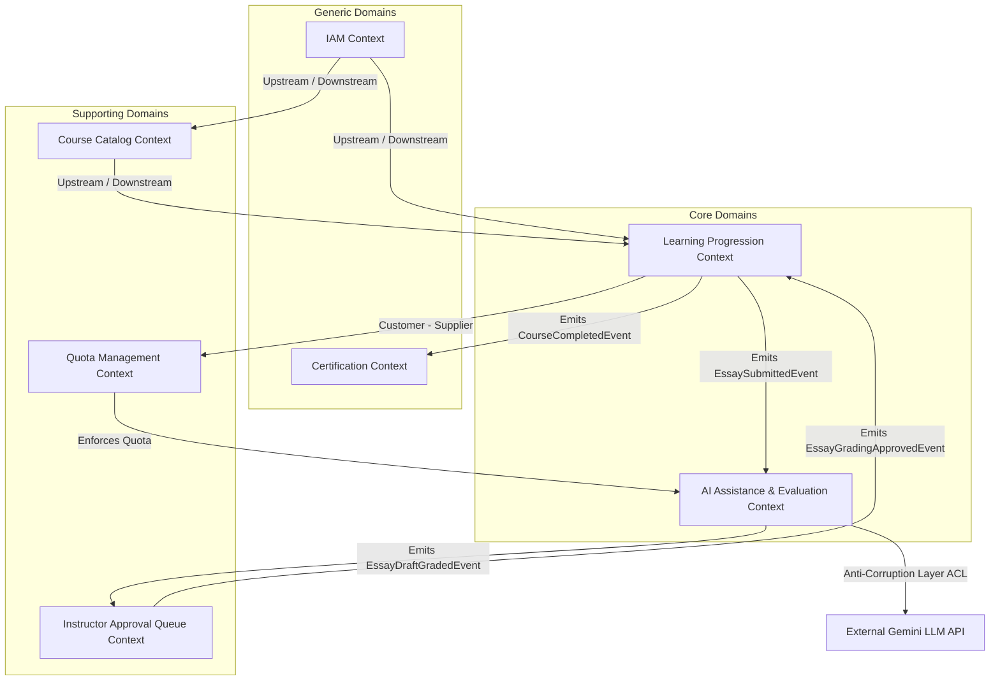
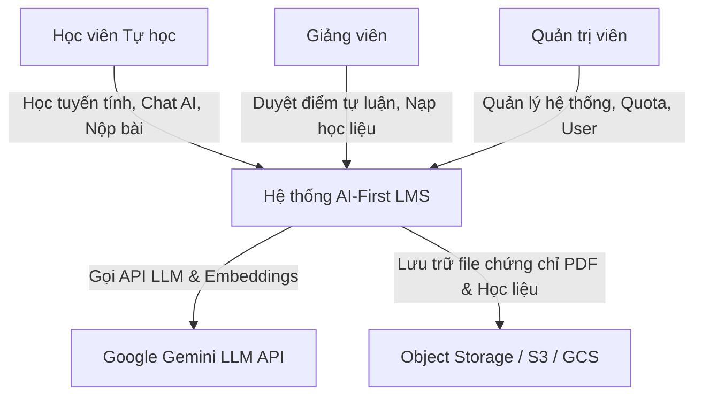
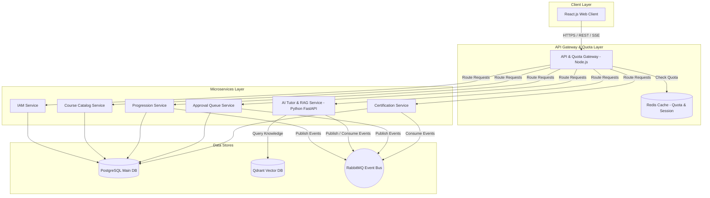
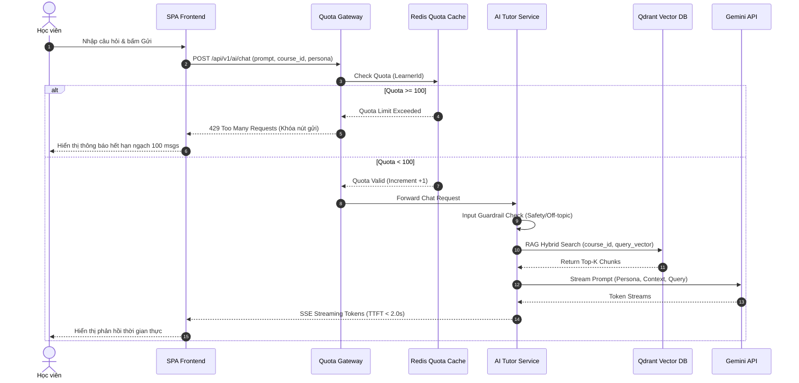
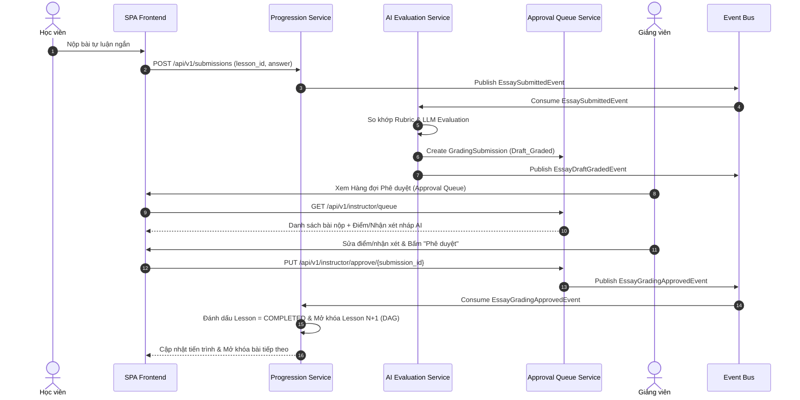
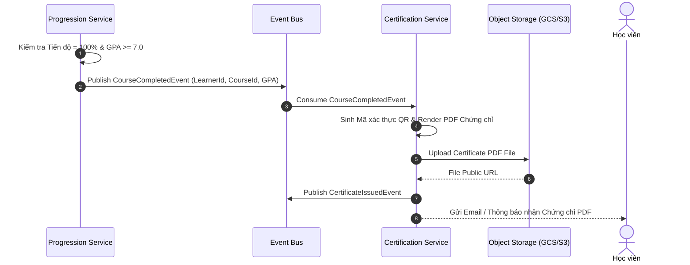

# BÁO CÁO PHÂN TÍCH VÀ THIẾT KẾ HỆ THỐNG QUẢN LÝ HỌC TẬP TRỰC TUYẾN TỰ HỌC THEO TIẾN ĐỘ CÁ NHÂN TÍCH HỢP TRỢ LÝ AI THEO PHƯƠNG PHÁP LUẬN DOMAIN-DRIVEN DESIGN (DDD)

---

## CHƯƠNG I: TỔNG QUAN VÀ KIẾN THỨC NỀN TẢNG

### 1.1 Tổng quan về Hệ thống Quản lý Học tập Trực tuyến (LMS)
Hệ thống Quản lý Học tập Trực tuyến (Learning Management System - LMS) là giải pháp phần mềm trung tâm giúp quản lý, phân phối, theo dõi và đánh giá các hoạt động đào tạo trực tuyến. 
Trong mô hình **Self-paced Learning (Tự học trực tuyến tự nguyện theo tiến độ cá nhân)**:
*   **Bản chất nghiệp vụ:** Người học chủ động tham gia nhằm nâng cao năng lực cá nhân ngoài giờ chính khóa.
*   **Đặc điểm tiến trình:** Học viên tuân theo đồ thị lộ trình tuyến tính (Directed Acyclic Graph - DAG), trong đó các bài học/chương tiếp theo chỉ được mở khóa khi người học hoàn thành các điều kiện của bài học trước (xem >90% thời lượng video, đạt điểm Quiz hoặc hoàn thành bài tập tự luận).
*   **Điểm nghẽn truyền thống:** Tỷ lệ hoàn thành khóa tự học thường rất thấp (<10%) do thiếu sự hỗ trợ tức thì khi gặp thắc mắc và sự trễ hạn trong việc chấm điểm bài tập tự luận ngắn từ giảng viên (thường kéo dài 3-7 ngày).

### 1.2 Kiến trúc Ứng dụng Web
Hệ thống áp dụng kiến trúc Web đa tầng hiện đại phân tách rõ ràng trách nhiệm:
*   **Single Page Application (SPA) Client Layer:** Xây dựng trên React.js / Vite với Tailwind CSS, cung cấp giao diện phản hồi nhanh, mượt mà và tương tác thời gian thực thông qua Server-Sent Events (SSE).
*   **API Gateway & Quota Gateway Layer:** Điểm tiếp nhận truy vấn duy nhất (Reverse Proxy / Routing), chịu trách nhiệm Authentication/Authorization, Rate Limiting và kiểm soát **Message Quota** dùng trợ lý AI.
*   **Microservices Layer:** Phân rã theo các Bounded Contexts của DDD, mỗi dịch vụ tự chủ về cơ sở dữ liệu và logic nghiệp vụ.

### 1.3 Công nghệ Phát triển Ứng dụng Web
*   **Frontend:** React 18, TypeScript, Redux Toolkit / React Query, SSE Client for streaming chat.
*   **Backend Services:** Node.js (TypeScript) / Python (FastAPI cho AI & RAG Services).
*   **Message Broker / Event Bus:** RabbitMQ / Apache Kafka để xử lý giao tiếp bất đồng bộ giữa các Bounded Contexts.
*   **Caching & Session Storage:** Redis Cache (lưu giữ Token Quota, Session State và Rate Limit counters).

### 1.4 AI Tạo Sinh (Generative AI) và Mô hình Ngôn ngữ Lớn (LLM)
*   **Generative AI:** Công nghệ trí tuệ nhân tạo có khả năng tạo ra nội dung mới (văn bản, mã nguồn, nhận xét bài tập) dựa trên ngữ cảnh được cung cấp.
*   **Mô hình Ngôn ngữ Lớn (LLM):** Sử dụng các mô hình tiên tiến như Google Gemini API (Gemini 1.5 Flash cho truy vấn phản hồi nhanh/thấp chi phí; Gemini 1.5 Pro cho tác vụ chấm nháp bài tự luận phức tạp).

### 1.5 Kiến trúc RAG (Retrieval-Augmented Generation)
RAG là kỹ thuật kết hợp giữa mô hình truy xuất thông tin (Information Retrieval) và mô hình sinh (Generation) nhằm giải quyết triệt để rủi ro ảo tưởng thông tin (Hallucination) của LLM:
1.  **Ingestion Phase:** Tài liệu khóa học (PDF, DOCX, Video Transcript) được chia nhỏ (Chunking), trích xuất Vector Embeddings bằng mô hình `text-embedding-004` và lưu vào Cơ sở dữ liệu Vector (Qdrant / Pinecone).
2.  **Retrieval Phase:** Khi học viên đặt câu hỏi, hệ thống chuyển câu hỏi thành Vector, truy xuất Top-K đoạn văn bản có độ tương đồng hình học cao nhất (Cosine Similarity) gắn với đúng `course_id`.
3.  **Generation Phase:** Đưa tài liệu truy xuất vào Prompt ngữ cảnh (Contextual Prompt) gửi LLM để sinh câu trả lời có trích dẫn nguồn cụ thể.

### 1.6 Kiến trúc Microservices
*   Hệ thống phân rã thành các dịch vụ độc lập theo ranh giới nghiệp vụ (Bounded Contexts), cho phép mở rộng quy mô linh hoạt (Horizontal Scaling), duy trì tính sẵn sàng cao và triển khai độc lập (Independent Deployment).
*   Giao tiếp nội bộ giữa các microservices kết hợp giữa **Synchronous REST/gRPC** (cho giao dịch yêu cầu phản hồi ngay) và **Asynchronous Event-Driven Architecture (EDA)** cho sự kiện miền (Domain Events).

### 1.7 An toàn và Kiểm soát Đầu ra của Hệ thống AI (AI Safety & Guardrails)
*   **Input Guardrails:** Chặn đứng Prompt Injection, Jailbreak, ngôn từ độc hại (Toxicity) và câu hỏi ngoài lề (Off-topic System Bypass).
*   **Output Guardrails:** Kiểm tra tính xác thực (Faithfulness Evaluator), đảm bảo AI trả lời trung thực với tài liệu đính kèm, bắt buộc trích dẫn nguồn (Citation) và không đưa ra đáp án trực tiếp khi học viên bật chế độ `Socratic`.

---

## CHƯƠNG II: PHÂN TÍCH YÊU CẦU NGHIỆP VỤ HỆ THỐNG

### 2.1 Bối cảnh & Khung Khái niệm Cốt lõi (BACCM™)
*   **Change:** Xây dựng LMS tự học tích hợp Trợ lý AI 24/7, tự động hóa chấm nháp tự luận và kiểm soát hạn ngạch API động.
*   **Need:** Học viên cần tháo gỡ thắc mắc tức thì 24/7 và nhận phản hồi bài làm nhanh; Giảng viên cần giảm tải chấm bài; Quản trị viên cần kiểm soát chi phí LLM.
*   **Solution:** LMS tự học theo tiến độ tuyến tính (DAG) + Cổng Quản lý Hạn ngạch Quota Gateway + AI Tutor RAG đa Persona + Hàng đợi Phê duyệt của Giảng viên (Teacher Approval Queue).
*   **Value:** Người học chủ động tốc độ và nhận chứng chỉ PDF; Giảng viên giảm 80% thời gian chấm bài; Hệ thống tối ưu chi phí hạ tầng.

### 2.2 Đặc tả Yêu cầu Chức năng (Functional Requirements - FR)
*   **FR-IAM-01 (Quản lý Tài khoản & Phân quyền):** Đăng ký, đăng nhập JWT, phân quyền Role-Based (Learner, Instructor, System Admin).
*   **FR-CAT-01 (Quản lý Khóa học & Mã kích hoạt):** Quản lý danh mục, khóa học, tài liệu đính kèm và tạo mã kích hoạt khóa học (Activation Codes).
*   **FR-PRG-01 (Lộ trình Tuyến tính DAG):** Kiểm soát mở khóa bài học tiếp theo dựa trên đồ thị phụ thuộc (Hoàn thành video >90%, Quiz pass, Bài tự luận được phê duyệt).
*   **FR-PRG-02 (Theo dõi Tiến độ & Kết quả):** Ghi nhận phần trăm tiến độ khóa học, GPA tích lũy, lịch sử học tập.
*   **FR-QUO-01 (Cổng Quản lý Hạn ngạch AI):** Kiểm tra Message Quota của học viên trước khi chuyển tiếp yêu cầu đến AI Engine (mặc định 100 câu hỏi/tháng cho tài khoản tiêu chuẩn).
*   **FR-AIE-01 (Trợ lý AI RAG & Persona Switcher):** Truy xuất tri thức theo khóa học; hỗ trợ 2 chế độ `Socratic` (gợi mở tư duy) và `Direct` (giải thích trực tiếp).
*   **FR-AIE-02 (AI Chấm nháp Bài tự luận):** AI tự động so khớp bài làm tự luận ngắn với Rubric, tạo bản chấm nháp (`Draft_Graded`) và gửi vào hàng đợi giảng viên.
*   **FR-TCH-01 (Hàng đợi Kiểm duyệt của Giảng viên):** Giảng viên xem, điều chỉnh điểm số/nhận xét nháp và phê duyệt kết quả chính thức.
*   **FR-CRT-01 (Cấp Chứng nhận PDF Tự động):** Tự động sinh chứng chỉ PDF ký số và mã QR xác thực khi tiến độ = 100% và GPA $\ge 7.0/10.0$.

### 2.3 Đặc tả Quy tắc Nghiệp vụ (Business Rules - BR)
*   **BR-COM-01 (Ràng buộc Hạn ngạch AI):** Mỗi tài khoản học viên tiêu chuẩn có hạn ngạch tối đa 100 tin nhắn AI/tháng. Khi đạt 100%, tạm khóa nút gửi câu hỏi.
*   **BR-AI-01 (Bắt buộc Liên kết RAG):** AI Tutor chỉ trả lời dựa trên nội dung tài liệu đính kèm của khóa học đó trong Vector DB.
*   **BR-AI-02 (Quy tắc Socratic Mode):** Khi ở chế độ `Socratic`, AI không được cung cấp lời giải hoặc mã nguồn hoàn chỉnh, chỉ được đặt câu hỏi gợi mở từng bước.
*   **BR-AI-03 (Chốt chặn Phê duyệt của Giảng viên):** Điểm tự luận do AI chấm chỉ có hiệu lực mở khóa tiến trình sau khi Giảng viên bấm nút "Phê duyệt" (`Approved`).
*   **BR-LMS-03 (Khóa Tiến trình Tuyến tính):** Bài học $N+1$ chỉ được mở khóa khi Bài học $N$ có trạng thái `COMPLETED`.
*   **BR-LMS-04 (Tiêu chuẩn Cấp Chứng chỉ):** Tiến độ học đạt 100% và điểm trung bình tích lũy $GPA \ge 7.0/10.0$.

---

## CHƯƠNG III: THIẾT KẾ HỆ THỐNG THEO PHƯƠNG PHÁP LUẬN DDD (STRATEGIC DESIGN)

### 3.1 Phân rã Miền Nghiệp vụ (Domain Decomposition)
Toàn bộ hệ thống LMS được phân rã thành 3 nhóm miền nghiệp vụ:

```
+-----------------------------------------------------------------------------+
|                                CORE DOMAIN                                  |
|  - Learning Progression Subdomain (Tiến trình học tuyến tính DAG)           |
|  - AI Assistance & Evaluation Subdomain (Trợ lý AI RAG & Chấm nháp tự luận)|
+-----------------------------------------------------------------------------+
|                             SUPPORTING DOMAIN                               |
|  - Access & Quota Control Subdomain (Cổng quản lý hạn ngạch API & kích hoạt)|
|  - Course Catalog & Knowledge Base Subdomain (Quản lý khóa học & Vector DB) |
|  - Instructor Approval Queue Subdomain (Hàng đợi kiểm duyệt của Giảng viên) |
+-----------------------------------------------------------------------------+
|                               GENERIC DOMAIN                                |
|  - Identity & Access Management - IAM Subdomain (Xác thực & Phân quyền)     |
|  - Certification Subdomain (Sinh chứng chỉ PDF ký số & Mã QR)               |
+-----------------------------------------------------------------------------+
```

### 3.2 Xác định các Bounded Contexts
Từ sự phân rã miền, hệ thống được chia thành 6 **Bounded Contexts** độc lập:

1.  **Identity & Access Management (IAM) Context:** Quản lý User, Credentials, User Roles (Learner, Instructor, Admin).
2.  **Course Catalog & Content Context:** Quản lý thông tin khóa học, cây danh mục, bài học, tài liệu đính kèm và mã kích hoạt (`ActivationCode`).
3.  **Learning Progression Context:** Quản lý đăng ký khóa học (`Enrollment`), trạng thái từng bài học (`LessonProgress`), tính toán đồ thị tiến trình tuyến tính (DAG) và điều kiện mở khóa.
4.  **Quota & Resource Management Context:** Quản lý hạn ngạch tin nhắn AI (`UserQuota`), theo dõi lượt sử dụng, kiểm tra định mức truy vấn trước khi gọi LLM.
5.  **AI Assistance & Evaluation Context:** Quản lý phiên hội thoại AI (`AISession`), thực hiện RAG Search, phân tích Persona (`Socratic`/`Direct`), áp dụng Guardrails và tạo bản chấm nháp bài tự luận (`Draft_Graded`).
6.  **Instructor Approval Queue Context:** Quản lý bài nộp tự luận cần phê duyệt (`GradingSubmission`), giao diện cho giảng viên kiểm duyệt và công bố điểm chính thức.
7.  **Certification Context:** Quản lý việc cấp phát và xác thực chứng chỉ số (`Certificate`).

### 3.3 Ngôn ngữ Chung (Ubiquitous Language Dictionary)

| Thuật ngữ | Khái niệm Kỹ thuật / Nghiệp vụ tương ứng | Bounded Context áp dụng |
| :--- | :--- | :--- |
| **Learner** | Học viên tự nguyện đăng ký tự học | IAM, Learning Progression |
| **Enrollment** | Bản ghi đăng ký tham gia khóa học của học viên | Learning Progression |
| **DAG Node** | Nút bài học trong đồ thị lộ trình tiến trình tuyến tính | Learning Progression |
| **Message Quota** | Hạn ngạch số lượt tin nhắn AI được phép gửi trong chu kỳ | Quota Management |
| **Quota Gateway** | Cổng kiểm tra hạn ngạch trước khi chuyển tiếp yêu cầu đến AI Engine | Quota Management |
| **RAG Knowledge Chunk**| Đoạn văn bản tài liệu đã đánh chỉ mục Vector Embedding | AI Assistance |
| **Persona Mode** | Chế độ tương tác của AI (`Socratic` khơi gợi hoặc `Direct` trực tiếp) | AI Assistance |
| **Draft Grading** | Bản chấm nháp bài tự luận do AI thực hiện (`Draft_Graded`) | AI Assistance |
| **Approval Queue** | Hàng đợi bài làm tự luận chờ Giảng viên phê duyệt | Instructor Approval Queue |
| **Final Score** | Điểm số tự luận chính thức sau khi Giảng viên phê duyệt | Instructor Approval Queue |
| **Digital Certificate** | Chứng nhận hoàn thành khóa học dưới dạng file PDF có chữ ký số | Certification |

### 3.4 Bản đồ Ngữ cảnh (Context Mapping)



---

## CHƯƠNG IV: THIẾT KẾ KỸ THUẬT (TACTICAL DESIGN & ARCHITECTURE)

### 4.1 Chi tiết Aggregates, Entities, Value Objects

#### 1. Learning Progression Context
*   **Aggregate Root:** `Enrollment`
    *   *Entities:* `LessonProgress`
    *   *Value Objects:* `EnrollmentId`, `LearnerId`, `CourseId`, `ProgressPercentage`, `GPA`, `LessonStatus` (`LOCKED`, `IN_PROGRESS`, `COMPLETED`), `CompletionCriteria` (VideoDurationPct, QuizScore, EssayScore).
    *   *Invariants:* Bài học $N+1$ không thể chuyển trạng thái thành `IN_PROGRESS` trừ khi Bài học $N$ có trạng thái `COMPLETED`.

#### 2. Quota & Resource Management Context
*   **Aggregate Root:** `UserQuota`
    *   *Entities:* `QuotaConsumptionLog`
    *   *Value Objects:* `QuotaId`, `LearnerId`, `MonthlyLimit` (100), `UsedCount`, `BillingCycle` (Month/Year), `QuotaStatus` (`ACTIVE`, `EXHAUSTED`).
    *   *Invariants:* Nếu `UsedCount` $\ge$ `MonthlyLimit`, `QuotaStatus` chuyển sang `EXHAUSTED` và từ chối mọi yêu cầu chat AI.

#### 3. AI Assistance & Evaluation Context
*   **Aggregate Root:** `AISession`
    *   *Entities:* `ChatMessage`, `EssayDraft`
    *   *Value Objects:* `SessionId`, `LearnerId`, `CourseId`, `PersonaMode` (`SOCRATIC`, `DIRECT`), `PromptContext`, `RubricScore`, `DraftStatus` (`DRAFT_GRADED`).
    *   *Invariants:* Mọi câu hỏi đặt ra phải đi qua Input Guardrail và đính kèm `CourseId` để truy xuất RAG vector.

#### 4. Instructor Approval Queue Context
*   **Aggregate Root:** `GradingSubmission`
    *   *Value Objects:* `SubmissionId`, `LearnerId`, `LessonId`, `StudentAnswer`, `AIDraftScore`, `AIDraftFeedback`, `InstructorFinalScore`, `InstructorFeedback`, `ApprovalStatus` (`PENDING`, `APPROVED`, `REJECTED`).
    *   *Invariants:* `InstructorFinalScore` chỉ được cập nhật bởi tài khoản có Role `INSTRUCTOR`.

#### 5. Certification Context
*   **Aggregate Root:** `Certificate`
    *   *Value Objects:* `CertificateId`, `LearnerId`, `CourseId`, `IssueDate`, `FinalGPA`, `VerificationCode`, `PdfStorageUrl`.

### 4.2 Danh sách Domain Events (Sự kiện Miền)
1.  `CourseActivatedEvent`: Phát ra khi học viên kích hoạt khóa học thành công.
2.  `LessonCompletedEvent`: Phát ra khi bài học đạt 100% điều kiện hoàn thành.
3.  `EssaySubmittedEvent`: Phát ra khi học viên nộp bài tự luận ngắn.
4.  `EssayDraftGradedEvent`: Phát ra khi AI hoàn tất chấm nháp bài tự luận.
5.  `EssayGradingApprovedEvent`: Phát ra khi Giảng viên duyệt điểm tự luận chính thức.
6.  `AIQuotaExhaustedEvent`: Phát ra khi học viên sử dụng hết hạn ngạch tin nhắn AI.
7.  `CourseCompletedEvent`: Phát ra khi học viên hoàn thành 100% đồ thị bài học.
8.  `CertificateIssuedEvent`: Phát ra khi hệ thống sinh xong file PDF chứng chỉ.

### 4.3 Kiến trúc Clean / Hexagonal Architecture (Ports & Adapters)
Mỗi Microservice được cấu trúc thành 4 tầng riêng biệt:

```
+-----------------------------------------------------------------------+
|  Presentation Layer (REST Controllers, SSE Handlers, GraphQL)         |
+-----------------------------------------------------------------------+
|  Application Layer (Use Cases, Command/Query Handlers, DTOs, Event)   |
+-----------------------------------------------------------------------+
|  Domain Layer (Entities, Value Objects, Domain Events, Services)      |
+-----------------------------------------------------------------------+
|  Infrastructure Layer (PostgreSQL Repositories, Redis, Qdrant, LLM)   |
+-----------------------------------------------------------------------+
```

### 4.4 Biểu đồ C4 Model

#### C4 Level 1: System Context Diagram



#### C4 Level 2: Container Diagram



---

## CHƯƠNG V: PHÂN HỆ TRỢ LÝ AI & NÂNG CAO ĐỘ TIN CẬY (GUARDRAILS & RAG)

### 5.1 Kiến trúc Cơ sở Tri thức RAG & Quy trình Ingestion
1.  **Ingestion Service:** Tiếp nhận file tài liệu bài giảng (PDF/DOCX/Transcripts) từ Giảng viên.
2.  **Chunking:** Chia văn bản thành các đoạn nhỏ (500 tokens, overlap 50 tokens).
3.  **Embedding:** Tạo vector qua `text-embedding-004`.
4.  **Metadata Indexing:** Gắn thẻ metadata (`course_id`, `lesson_id`, `chapter_id`) và lưu vào Qdrant Vector Collection.

### 5.2 Thiết kế Bộ kiểm soát An toàn (Guardrails Framework)

```
[User Question] ──► [Input Guardrail] ──► [RAG Vector Search] ──► [LLM Generation] ──► [Output Guardrail] ──► [SSE Stream to User]
                           │                                                              │
                           ▼ (Violation)                                                  ▼ (Violation)
                   [Chặn & Báo lỗi]                                              [Tự động Điều chỉnh / Fallback]
```

*   **Input Guardrail:**
    *   *Prompt Injection Check:* Kiểm tra xem câu hỏi có chứa câu lệnh phá vỡ hệ thống không (ví dụ: "Ignore previous instructions").
    *   *Off-topic Check:* So sánh ngữ cảnh câu hỏi với danh mục nội dung khóa học; từ chối trả lời câu hỏi lạc đề không thuộc học thuật.
*   **Output Guardrail:**
    *   *Faithfulness Check:* Đảm bảo các khẳng định trong câu trả lời khớp với thông tin trích xuất từ Vector DB.
    *   *Persona Enforcer:* Nếu ở `Socratic Mode`, chặn các câu trả lời chứa đoạn mã hoàn chỉnh hoặc đáp án trực tiếp, chuyển hướng thành câu hỏi gợi mở.

### 5.3 Cổng Quản lý Hạn ngạch (Quota Gateway Logic)

```python
# Pseudo-code kiểm tra Quota tại Cổng Quota Gateway
def validate_ai_quota(learner_id: str) -> bool:
    quota_key = f"quota:{learner_id}:{current_month()}"
    used_count = redis_client.get(quota_key) or 0
    monthly_limit = get_user_limit(learner_id) # Default: 100
    
    if int(used_count) >= monthly_limit:
        raise QuotaExhaustedException("Bạn đã dùng hết 100 tin nhắn AI trong tháng. Vui lòng đợi chu kỳ tiếp theo.")
    
    return True
```

---

## CHƯƠNG VI: THIẾT KẾ CƠ SỞ DỮ LIỆU & API SPECIFICATION

### 6.1 Thiết kế Cơ sở Dữ liệu (PostgreSQL DDL Schemas)

```sql
-- 1. Bảng Người dùng (IAM Context)
CREATE TABLE users (
    user_id UUID PRIMARY KEY DEFAULT gen_random_uuid(),
    email VARCHAR(255) UNIQUE NOT NULL,
    password_hash VARCHAR(255) NOT NULL,
    full_name VARCHAR(100) NOT NULL,
    role VARCHAR(20) NOT NULL CHECK (role IN ('LEARNER', 'INSTRUCTOR', 'ADMIN')),
    created_at TIMESTAMP WITH TIME ZONE DEFAULT CURRENT_TIMESTAMP
);

-- 2. Bảng Khóa học & Mã kích hoạt (Catalog Context)
CREATE TABLE courses (
    course_id UUID PRIMARY KEY DEFAULT gen_random_uuid(),
    title VARCHAR(255) NOT NULL,
    description TEXT,
    instructor_id UUID REFERENCES users(user_id),
    created_at TIMESTAMP WITH TIME ZONE DEFAULT CURRENT_TIMESTAMP
);

CREATE TABLE activation_codes (
    code_id UUID PRIMARY KEY DEFAULT gen_random_uuid(),
    code VARCHAR(50) UNIQUE NOT NULL,
    course_id UUID REFERENCES courses(course_id),
    is_used BOOLEAN DEFAULT FALSE,
    used_by UUID REFERENCES users(user_id),
    used_at TIMESTAMP WITH TIME ZONE
);

-- 3. Bảng Bài học & Đồ thị Tuyến tính DAG (Progression Context)
CREATE TABLE lessons (
    lesson_id UUID PRIMARY KEY DEFAULT gen_random_uuid(),
    course_id UUID REFERENCES courses(course_id),
    title VARCHAR(255) NOT NULL,
    video_url VARCHAR(500),
    video_duration_seconds INT DEFAULT 0,
    prerequisite_lesson_id UUID REFERENCES lessons(lesson_id), -- DAG Link
    order_index INT NOT NULL
);

CREATE TABLE enrollments (
    enrollment_id UUID PRIMARY KEY DEFAULT gen_random_uuid(),
    learner_id UUID REFERENCES users(user_id),
    course_id UUID REFERENCES courses(course_id),
    progress_percentage DECIMAL(5,2) DEFAULT 0.00,
    gpa DECIMAL(3,2) DEFAULT 0.00,
    status VARCHAR(20) DEFAULT 'ACTIVE',
    enrolled_at TIMESTAMP WITH TIME ZONE DEFAULT CURRENT_TIMESTAMP,
    UNIQUE(learner_id, course_id)
);

CREATE TABLE lesson_progress (
    progress_id UUID PRIMARY KEY DEFAULT gen_random_uuid(),
    enrollment_id UUID REFERENCES enrollments(enrollment_id),
    lesson_id UUID REFERENCES lessons(lesson_id),
    status VARCHAR(20) DEFAULT 'LOCKED' CHECK (status IN ('LOCKED', 'IN_PROGRESS', 'COMPLETED')),
    video_watched_seconds INT DEFAULT 0,
    quiz_score DECIMAL(4,2),
    essay_status VARCHAR(20) DEFAULT 'NONE',
    completed_at TIMESTAMP WITH TIME ZONE,
    UNIQUE(enrollment_id, lesson_id)
);

-- 4. Bảng Hạn ngạch AI (Quota Context)
CREATE TABLE user_quotas (
    quota_id UUID PRIMARY KEY DEFAULT gen_random_uuid(),
    learner_id UUID REFERENCES users(user_id) UNIQUE,
    monthly_limit INT DEFAULT 100,
    used_count INT DEFAULT 0,
    billing_month INT NOT NULL,
    billing_year INT NOT NULL,
    updated_at TIMESTAMP WITH TIME ZONE DEFAULT CURRENT_TIMESTAMP
);

-- 5. Bảng Hàng đợi Phê duyệt bài tự luận (Instructor Queue Context)
CREATE TABLE grading_submissions (
    submission_id UUID PRIMARY KEY DEFAULT gen_random_uuid(),
    enrollment_id UUID REFERENCES enrollments(enrollment_id),
    lesson_id UUID REFERENCES lessons(lesson_id),
    student_answer TEXT NOT NULL,
    ai_draft_score DECIMAL(4,2),
    ai_draft_feedback TEXT,
    instructor_final_score DECIMAL(4,2),
    instructor_feedback TEXT,
    approval_status VARCHAR(20) DEFAULT 'PENDING' CHECK (approval_status IN ('PENDING', 'APPROVED', 'REJECTED')),
    submitted_at TIMESTAMP WITH TIME ZONE DEFAULT CURRENT_TIMESTAMP,
    approved_at TIMESTAMP WITH TIME ZONE
);

-- 6. Bảng Chứng chỉ (Certification Context)
CREATE TABLE certificates (
    certificate_id UUID PRIMARY KEY DEFAULT gen_random_uuid(),
    enrollment_id UUID REFERENCES enrollments(enrollment_id) UNIQUE,
    verification_code VARCHAR(100) UNIQUE NOT NULL,
    final_gpa DECIMAL(3,2) NOT NULL,
    pdf_url VARCHAR(500) NOT NULL,
    issued_at TIMESTAMP WITH TIME ZONE DEFAULT CURRENT_TIMESTAMP
);
```

### 6.2 Biểu đồ Luồng Tuần tự (Sequence Diagrams)

#### Luồng 1: Học viên hỏi đáp Trợ lý AI qua Quota Gateway & SSE Streaming



#### Luồng 2: Nộp Bài Tự Luận ──> AI Chấm Nháp ──> Giảng Viên Duyệt ──> Mở Khóa DAG



#### Luồng 3: Tự Động Cấp Chứng Chỉ PDF (GPA $\ge 7.0$)



---

## CHƯƠNG VII: KIỂM THỬ VÀ HOÀN THIỆN HỆ THỐNG

### 7.1 Kế hoạch Kiểm thử Hệ thống (Testing Strategy)
*   **Unit Testing:** Kiểm thử đơn vị các Domain Entities và Rule Invariants (kiểm tra tính hợp lệ của tiến trình DAG, tính toán GPA, logic cộng trừ Quota).
*   **Integration Testing:** Kiểm thử tích hợp giữa Quota Gateway với Redis Cache, và giao tiếp giữa các Bounded Contexts qua Event Bus (RabbitMQ).
*   **Guardrails & AI Safety Testing:**
    *   Thực hiện 100+ kịch bản Prompt Injection / Jailbreak để đánh giá tỷ lệ chặn của Input Guardrail (Mục tiêu $\ge 98\%$).
    *   Thử nghiệm các câu hỏi ngoài lề (Off-topic) để đảm bảo AI chỉ trả lời trong phạm vi học liệu (Mục tiêu $\ge 95\%$).
*   **Performance & Load Testing:**
    *   Sử dụng k6 / Locust mô phỏng 1,000 phiên chat đồng thời.
    *   Đo lường thời gian Time to First Token (TTFT) để đảm bảo luôn $< 2.0$ giây thông qua cơ chế SSE streaming.

---

## CHƯƠNG VIII: KẾT LUẬN VÀ HƯỚNG PHÁT TRIỂN

1.  **Kết quả đạt được:**
    *   Hoàn thành bản phân tích và thiết kế toàn diện hệ thống AI-First LMS theo đúng phương pháp luận **Domain-Driven Design (DDD)**.
    *   Giải quyết triệt để 3 bài toán lớn của tự học: Động lực học tập nhờ Trợ lý AI đồng hành 24/7, Tự động hóa chấm nháp bài tự luận cho giảng viên, và Kiểm soát chi phí hạ tầng AI nhờ Quota Gateway.
2.  **Đóng góp về mặt kiến trúc:**
    *   Tách biệt rõ ràng các ranh giới Bounded Contexts, áp dụng Clean Architecture kết hợp Event-Driven Architecture giúp hệ thống mở rộng và bảo trì dễ dàng.
    *   Thiết kế thành công cơ chế **Teacher-in-the-loop** giúp đảm bảo tính chính xác học thuật tối đa trong đánh giá kết quả người học.
