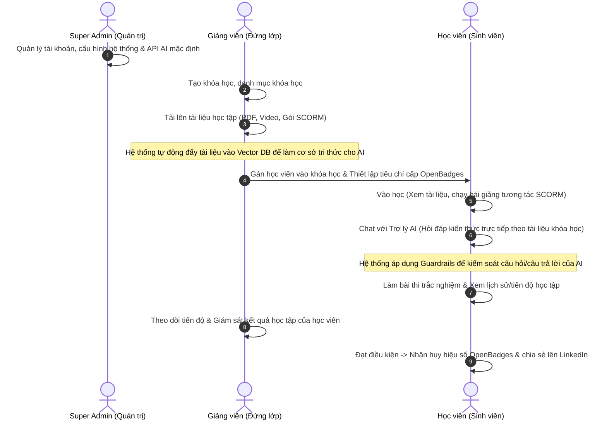

# ĐẶC TẢ NGHIỆP VỤ CHI TIẾT CỦA 3 VAI TRÒ (ROLES) BÁM SÁT ĐỀ CƯƠNG TTTN
**Đề tài:** Hệ thống quản lý học tập trực tuyến (LMS) tích hợp Trợ lý AI hỗ trợ học tập.

Để bám sát 100% đề cương yêu cầu trong file [docs.md](file:///e:/TTTN/docs.md), hệ thống sẽ tối giản hóa nghiệp vụ, tập trung vào mô hình trường học/học viện chuẩn với **3 vai trò (Roles) cốt lõi**: **Super Admin**, **Giảng viên (Teacher)**, và **Học viên (Student)**. 

Mô hình này loại bỏ phân hệ đối tác bên thứ ba phức tạp, giúp bạn tập trung 100% thời gian vào phần code LMS cốt lõi và Trợ lý AI RAG + Guardrails.

---

## 1. SƠ ĐỒ PHỐI HỢP NGHIỆP VỤ (WORKFLOW)

Quy trình phối hợp giữa 3 vai trò trong một chu kỳ học tập tích hợp AI:

---

## 2. PHÂN BỔ NGHIỆP VỤ CHI TIẾT BÁM SÁT ĐỀ CƯƠNG

Dưới đây là cách ánh xạ các yêu cầu thực hành trong đề cương vào chức năng nghiệp vụ của 3 vai trò:

### 2.1. VAI TRÒ: SUPER ADMIN (QUẢN TRỊ HỆ THỐNG)
*Bám sát yêu cầu: "Quản lý tài khoản người dùng" & "Xây dựng chức năng quản trị hệ thống".*

*   **Quản lý người dùng:** Tạo mới, phê duyệt, khóa hoặc xóa tài khoản của Giảng viên và Học viên trên hệ thống.
*   **Giám sát hệ thống:** Xem thống kê tổng quan (số lượng khóa học, số lượng học viên đang hoạt động, lượng tài nguyên lưu trữ đã sử dụng).
*   **Cấu hình kỹ thuật:** Quản lý cấu hình API kết nối với LLM (Gemini API) và kiểm soát tài nguyên máy chủ.

---

### 2.2. VAI TRÒ: GIẢNG VIÊN (TEACHER)
*Bám sát yêu cầu: "Quản lý khóa học/danh mục", "Quản lý bài học/tài liệu", "Theo dõi tiến độ học viên", "Quản lý kết quả/lịch sử học tập", và "Xây dựng cơ sở tri thức từ nội dung khóa học".*

*   **Quản lý Khóa học & Danh mục:** Tạo mới khóa học, phân loại khóa học vào các danh mục (ví dụ: Công nghệ thông tin, Kinh tế...).
*   **Quản lý Bài học & Học liệu (Cơ sở tri thức AI):**
    *   Tạo các chương mục, bài học nhỏ cho khóa học.
    *   Tải lên các định dạng học liệu: Video, tài liệu PDF, bài giảng tương tác chuẩn **SCORM**.
    *   **Xây dựng cơ sở tri thức cho AI:** Khi giảng viên tải tài liệu học tập (PDF/Text) lên, hệ thống sẽ tự động kích hoạt tiến trình vector hóa tài liệu này và lưu vào Vector Database để làm dữ liệu nền cho Trợ lý AI.
*   **Quản lý Học viên & Cấp chứng nhận (OpenBadges):**
    *   Gán học viên vào khóa học.
    *   Thiết lập điều kiện để học viên hoàn thành khóa học (ví dụ: đạt trên 80% tiến độ học và thi đỗ Quiz) để nhận huy hiệu **OpenBadges**.
*   **Theo dõi & Giám sát:**
    *   Xem báo cáo tiến độ học tập chi tiết của từng học viên (đã học bài nào, hoàn thành bao nhiêu phần trăm).
    *   Xem lịch sử điểm số và lịch sử hội thoại của học viên với Trợ lý AI (để nắm bắt xem học viên đang gặp khó khăn ở phần kiến thức nào).

---

### 2.3. VAI TRÒ: HỌC VIÊN (STUDENT)
*Bám sát yêu cầu: "Theo dõi tiến độ", "Quản lý kết quả/lịch sử", "Xây dựng trợ lý AI hỗ trợ học tập", và "Sinh phản hồi phù hợp với nội dung khóa học".*

*   **Học tập & Tương tác:**
    *   Vào khóa học được gán, học các bài giảng bằng video/PDF hoặc tương tác trực tiếp trên slide bài giảng chuẩn **SCORM**.
    *   Hệ thống tự động ghi nhận tiến độ học (ví dụ: đã học xong bài 1, bài 2).
*   **Học tập cùng Trợ lý AI (RAG chatbot):**
    *   Trong quá trình học, học viên mở khung chat với Trợ lý AI.
    *   Đặt câu hỏi thắc mắc. AI sẽ truy xuất thông tin từ cơ sở tri thức (học liệu do Giảng viên upload ở khóa học đó) để sinh phản hồi chính xác, bám sát nội dung bài học.
    *   *Kiểm soát an toàn (Guardrails):* Câu hỏi và câu trả lời của học viên sẽ đi qua bộ lọc Guardrails của hệ thống để đảm bảo không vi phạm an toàn thông tin và không trả lời lạc đề môn học.
*   **Đánh giá & Xem lịch sử:**
    *   Làm bài thi trắc nghiệm để hệ thống tự động chấm điểm.
    *   Xem tiến độ học tập của bản thân thông qua biểu đồ trực quan.
    *   Xem lịch sử kết quả thi cử, xem lại lịch sử chat với AI để ôn tập.
    *   Nhận và chia sẻ chứng chỉ số **OpenBadges** lên hồ sơ chuyên môn (LinkedIn).
