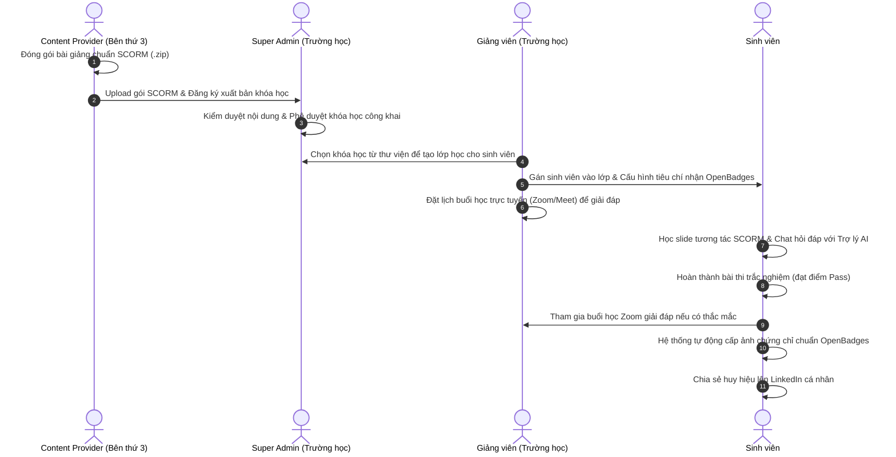

# ĐẶC TẢ NGHIỆP VỤ CHI TIẾT CỦA 4 VAI TRÒ (ROLES)
**Đề tài:** Hệ thống quản lý học tập trực tuyến (LMS) tích hợp Trợ lý AI, hỗ trợ SCORM và OpenBadges.

---

## 1. SƠ ĐỒ PHỐI HỢP NGHIỆP VỤ (WORKFLOW)

Quy trình phối hợp giữa 4 vai trò khi triển khai một khóa học chuẩn SCORM từ bên thứ ba:

---

## 2. ĐẶC TẢ CHI TIẾT NGHIỆP VỤ TỪNG VAI TRÒ

### 2.1. VAI TRÒ: SUPER ADMIN (QUẢN TRỊ HỆ THỐNG)
Super Admin là người sở hữu và vận hành hệ thống LMS. Nhiệm vụ chính là đảm bảo hệ thống chạy ổn định, an toàn thông tin và kiểm soát tài nguyên.

#### Các nghiệp vụ chính:
1.  **Quản lý Tài khoản & Phân quyền:**
    *   Tạo, khóa hoặc xóa tài khoản của người dùng (Sinh viên, Giảng viên).
    *   Phê duyệt hồ sơ đăng ký của các Đối tác bên thứ ba (Content Provider) sau khi ký hợp đồng liên kết.
2.  **Kiểm duyệt Học liệu & Khóa học (Content Moderation):**
    *   Nhận yêu cầu xuất bản khóa học từ các đối tác bên thứ ba.
    *   Kiểm tra tính hợp lệ của gói SCORM tải lên (quét virus, kiểm tra cấu trúc file `imsmanifest.xml`).
    *   Phê duyệt hoặc từ chối xuất bản khóa học lên thư viện dùng chung của nhà trường.
3.  **Cấu hình Hệ thống & Dịch vụ AI:**
    *   Quản lý API Keys của mô hình ngôn ngữ lớn (LLM - ví dụ Gemini API) và cơ sở dữ liệu Vector Database.
    *   Cấu hình các bộ lọc an toàn hệ thống (Safety Settings mặc định cho AI).
4.  **Báo cáo & Giám sát Hệ thống:**
    *   Theo dõi tổng số lượng sinh viên đang trực tuyến, số lượng tài nguyên lưu trữ đã sử dụng.
    *   Báo cáo doanh thu khóa học (nếu có chia sẻ doanh thu với bên thứ ba).

---

### 2.2. VAI TRÒ: CONTENT PROVIDER (BÊN THỨ BA / NHÀ CUNG CẤP KHÓA HỌC)
Content Provider là các đơn vị liên kết bên ngoài trường học, chịu trách nhiệm cung cấp nội dung đào tạo chất lượng cao đạt chuẩn quốc tế.

#### Các nghiệp vụ chính:
1.  **Quản lý Tài nguyên SCORM:**
    *   Tạo mới, chỉnh sửa hoặc xóa các gói bài giảng chuẩn **SCORM** (.zip).
    *   Hệ thống tự động phân tích gói zip và ánh xạ cấu trúc bài giảng tương tác lên giao diện khóa học.
2.  **Thiết kế Lộ trình Khóa học (Course Architect):**
    *   Tạo khóa học mới, kéo thả các gói bài giảng SCORM, video bài giảng, tài liệu PDF vào các chương mục phù hợp.
    *   Thiết lập ngân hàng câu hỏi và tạo các bài thi trắc nghiệm (Quiz) đánh giá năng lực cuối khóa.
3.  **Cấu hình Huy hiệu Số (OpenBadges):**
    *   Đăng tải hình ảnh thiết kế huy hiệu khóa học (định dạng PNG/SVG).
    *   Thiết lập siêu dữ liệu (Metadata) cho huy hiệu: Tên huy hiệu, Tổ chức cấp (Tên đối tác), Mô tả kỹ năng đạt được sau khóa học.
4.  **Theo dõi Hiệu quả Khóa học:**
    *   Xem thống kê số lượng học viên đăng ký học khóa học của mình.
    *   Đánh giá phản hồi, xếp hạng (Rating/Review) của sinh viên để nâng cao chất lượng học liệu.

---

### 2.3. VAI TRÒ: TEACHER / MENTOR (GIẢNG VIÊN CỦA TRƯỜNG)
Giảng viên là người trực tiếp quản lý lớp học, hướng dẫn, giải đáp thắc mắc và chấm điểm cho sinh viên.

#### Các nghiệp vụ chính:
1.  **Khai thác Khóa học (Course Adoption):**
    *   Duyệt qua thư viện khóa học dùng chung của nhà trường (do bên thứ ba cung cấp).
    *   Chọn khóa học phù hợp để nhập (import) về làm giáo trình giảng dạy cho lớp học của mình.
2.  **Tổ chức Lớp học & Quản lý Học viên:**
    *   Tạo lớp học mới (ví dụ: *Lớp Lập trình Web C31*).
    *   Thêm sinh viên vào lớp học (bằng cách nhập danh sách Excel hoặc cung cấp Mã lớp cho sinh viên tự đăng ký).
    *   Cấu hình luật hoàn thành khóa học: Ví dụ đạt tối thiểu 80% thời lượng học SCORM và trên 7.0 điểm thi trắc nghiệm thì mới được cấp OpenBadge.
3.  **Hỗ trợ trực tiếp & Lên lịch phòng học trực tuyến (Mentoring):**
    *   Tạo lịch hẹn và chèn link phòng học trực tuyến (Zoom, Google Meet, Teams) cho các buổi giải đáp trực tiếp (Office Hours).
    *   Hỗ trợ trả lời các câu hỏi chuyên sâu của sinh viên trên Diễn đàn thảo luận (Forum) của lớp học.
4.  **Giám sát Tiến độ & Điểm số:**
    *   Theo dõi bảng điểm chi tiết của cả lớp (điểm SCORM tự động trả về, thời gian hoàn thành).
    *   Chấm điểm thủ công các bài tập lớn, bài viết tự luận (nếu có).

---

### 2.4. VAI TRÒ: STUDENT (SINH VIÊN / HỌC VIÊN)
Sinh viên là đối tượng phục vụ chính của hệ thống LMS, tham gia học tập chủ động và tương tác với công nghệ.

#### Các nghiệp vụ chính:
1.  **Đăng ký & Vào học:**
    *   Tìm kiếm khóa học, nhập mã lớp học do giảng viên cung cấp để tham gia vào lớp.
    *   Xem lộ trình học tập trực quan và các lịch hẹn buổi học trực tuyến qua Zoom/Meet của giảng viên.
2.  **Học tập Tương tác & Chat với Trợ lý AI:**
    *   Mở và học trực tiếp các slide tương tác chuẩn SCORM (làm bài quiz tương tác ngay trên slide, kéo thả, chọn đáp án).
    *   **Chat với Trợ lý AI (RAG):** Đặt câu hỏi thắc mắc liên quan trực tiếp đến nội dung bài học đang xem. AI sẽ đọc tài liệu của bài đó để trả lời chính xác, giúp sinh viên giải quyết khó khăn ngay lập tức.
3.  **Đánh giá & Nhận OpenBadges:**
    *   Làm bài thi trắc nghiệm cuối kỳ được chấm điểm tự động.
    *   Nhận huy hiệu điện tử OpenBadges khi đạt yêu cầu hoàn thành lớp học.
    *   Tải xuống file ảnh huy hiệu thông minh (chứa metadata xác thực) hoặc nhấn nút chia sẻ trực tiếp lên trang hồ sơ cá nhân **LinkedIn**.
4.  **Xem Bảng xếp hạng (Gamification):**
    *   Xem bảng xếp hạng điểm số và số lượng huy hiệu đã thu thập được của bản thân so với các bạn học sinh khác trong cùng lớp để tạo động lực thi đua.
