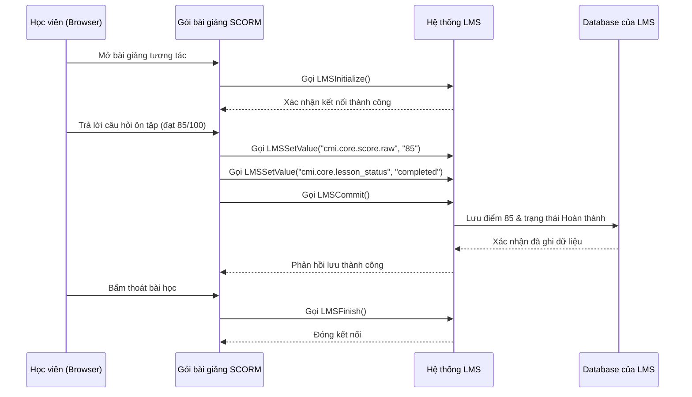
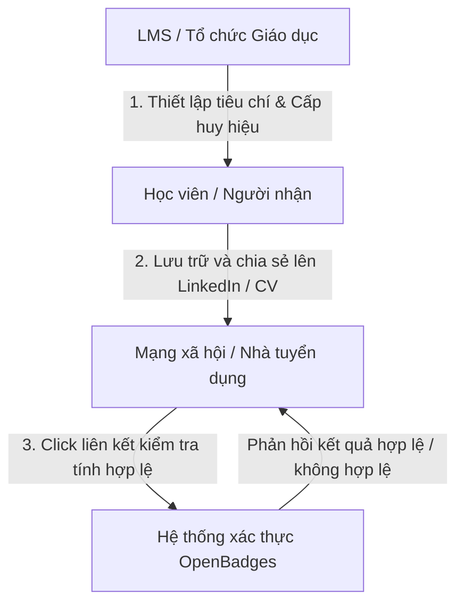

# Nghiên cứu & Phân tích Tiêu chuẩn E-learning: SCORM và OpenBadges

Tài liệu này cung cấp định nghĩa chi tiết, cơ chế hoạt động, lợi ích thực tế và phân tích mức độ cần thiết của hai tiêu chuẩn phổ biến trong hệ thống quản lý học tập trực tuyến (LMS): **SCORM** và **OpenBadges**.

---

## PHẦN 1: TIÊU CHUẨN SCORM

### 1. SCORM là gì?
**SCORM** viết tắt của **Shareable Content Object Reference Model** (Mô hình tham chiếu đối tượng nội dung chia sẻ được). Đây là một tập hợp các tiêu chuẩn kỹ thuật dành cho các hệ thống e-learning, quy định cách đóng gói bài giảng điện tử và cách bài giảng đó giao tiếp với hệ thống LMS.

*   **Shareable (Chia sẻ được):** Nội dung học tập có thể được sử dụng trong nhiều hệ thống LMS khác nhau.
*   **Content Object (Đối tượng nội dung):** Các phần nhỏ của nội dung học liệu (slide, video, câu hỏi tương tác).
*   **Reference Model (Mô hình tham chiếu):** Bộ tiêu chuẩn tham chiếu chung được đồng thuận bởi ngành công nghiệp e-learning toàn cầu (được phát triển ban đầu bởi tổ chức **ADL** - Advanced Distributed Learning thuộc Bộ Quốc phòng Mỹ).

---

### 2. Cách thức hoạt động của SCORM
Một bài giảng chuẩn SCORM hoạt động dựa trên hai cơ chế cốt lõi: **Đóng gói dữ liệu (Content Packaging)** và **Giao tiếp thời gian thực (Run-Time Communication API)**.

#### A. Đóng gói dữ liệu (Content Packaging)
Bài giảng sau khi xuất bản sẽ được nén thành một file duy nhất có định dạng `.zip` (gọi là **SCORM Package**). Cấu trúc của file zip này bắt buộc phải có:
*   Các file nội dung (HTML, CSS, JS, hình ảnh, video...).
*   Một file mục lục đặc biệt tên là **`imsmanifest.xml`** nằm ở thư mục gốc. File XML này định nghĩa cấu trúc khóa học (chương, bài, thứ tự hiển thị) để LMS có thể đọc và dựng lên menu bài học tự động mà không cần lập trình viên can thiệp.

#### B. Giao tiếp thời gian thực (Run-Time Communication)
Khi học viên mở bài giảng SCORM trên trình duyệt, bài giảng sẽ chạy dưới dạng một trang web tương tác. SCORM sử dụng ngôn ngữ **JavaScript** để giao tiếp trực tiếp với LMS (qua cửa sổ cha/iframe chứa bài giảng).

Các hàm giao tiếp cơ bản bao gồm:
*   `LMSInitialize()`: Khởi tạo kết nối giữa bài giảng và LMS khi học viên mở bài học.
*   `LMSGetValue(parameter)`: Lấy dữ liệu từ LMS (ví dụ: tên học viên để hiển thị lời chào trên slide).
*   `LMSSetValue(parameter, value)`: Gửi dữ liệu từ bài giảng về LMS để lưu lại vào cơ sở dữ liệu:
    *   `cmi.core.lesson_location`: Lưu vị trí slide học viên đang đọc (để lần sau học tiếp).
    *   `cmi.core.lesson_status`: Trạng thái bài học (`completed` - đã hoàn thành, `incomplete` - chưa hoàn thành).
    *   `cmi.core.score.raw`: Điểm số học viên đạt được trong các câu hỏi tương tác.
    *   `cmi.core.session_time`: Thời gian học viên thực tế tương tác với bài học.
*   `LMSCommit()`: Yêu cầu LMS lưu dữ liệu ngay lập tức vào database.
*   `LMSFinish()`: Kết thúc phiên học khi học viên đóng trình duyệt.



---

### 3. So sánh các phiên bản SCORM phổ biến
Hiện tại, có 2 phiên bản SCORM được áp dụng rộng rãi nhất:

| Đặc điểm so sánh | SCORM 1.2 (Ra đời năm 2001) | SCORM 2004 (Phiên bản mới hơn) |
| :--- | :--- | :--- |
| **Độ phổ biến** | Cực kỳ phổ biến, hầu như 100% các LMS đều hỗ trợ. | Phổ biến trung bình, phức tạp hơn khi triển khai. |
| **Giới hạn lưu trữ dữ liệu** | Dung lượng lưu trữ trạng thái học tập (suspend_data) bị giới hạn thấp (4096 ký tự), dễ gây mất tiến trình với các bài học siêu dài. | Dung lượng lưu trữ trạng thái học tập lớn hơn nhiều (64,000 ký tự). |
| **Tính năng Sequence (Ràng buộc)** | Không hỗ trợ ràng buộc thứ tự học phức tạp. | Hỗ trợ điều hướng bắt buộc (ví dụ: Học viên bắt buộc phải thi đỗ bài 1 mới được mở bài 2). |
| **Đánh giá điểm số** | Chỉ lưu một điểm số duy nhất cho toàn bộ gói bài học. | Cho phép phân tách điểm của nhiều phần thi nhỏ trong cùng một bài học. |

---

### 4. Hạn chế của SCORM và sự thay thế trong tương lai
Dù là tiêu chuẩn vàng, SCORM vẫn có những điểm yếu:
*   **Chỉ chạy trên trình duyệt web:** SCORM không hoạt động tốt trên các ứng dụng di động native (App Mobile) nếu không dùng Webview.
*   **Bắt buộc phải kết nối Internet liên tục:** Nếu học viên mất mạng khi đang làm bài giảng SCORM, dữ liệu điểm số sẽ không được gửi về LMS (LMSFinish sẽ lỗi).
*   **Không hỗ trợ học tập phi truyền thống:** SCORM không theo dõi được các hoạt động như thảo luận nhóm, đọc sách offline, thực hành trên máy ảo...

> [!NOTE]
> Để khắc phục các hạn chế này, ngành e-learning đã phát triển chuẩn **xAPI (Tin Can API)** và **LTI (Learning Tools Interoperability)** giúp theo dõi hoạt động học tập ở mọi thiết bị và tích hợp sâu các phần mềm bên ngoài vào LMS.

---

## PHẦN 2: TIÊU CHUẨN OPENBADGES

### 1. OpenBadges là gì?
**OpenBadges** là một tiêu chuẩn mở toàn cầu (được khởi xướng ban đầu bởi Mozilla và hiện đang được quản lý bởi tổ chức **1EdTech Consortium**) dành cho việc cấp và xác thực các **huy hiệu kỹ thuật số (digital badges)**.

Một Huy hiệu OpenBadge không đơn thuần là một file ảnh định dạng PNG/SVG thông thường. Nó là một **"Huy hiệu thông minh"** chứa siêu dữ liệu (metadata) được mã hóa bằng mã JSON-LD nhúng trực tiếp vào trong bức ảnh đó.

```
+-------------------------------------------------------------+
|                     FILE ẢNH HUY HIỆU                       |
|  [ Hình ảnh thiết kế trực quan: Logo Học viện, Tên Kỹ năng ]|
|                                                             |
|  +-------------------------------------------------------+  |
|  |           METADATA ĐƯỢC MÃ HÓA (JSON-LD)              |  |
|  |  * Người nhận (Recipient): sinhvien@email.edu.vn       |  |
|  |  * Tổ chức cấp (Issuer): Trường Đại học Bách Khoa     |  |
|  |  * Tiêu chí đạt được (Criteria): Đạt 9.0 môn Python   |  |
|  |  * Ngày cấp (Issued On): 07/07/2026                   |  |
|  |  * Mã xác thực (Verification Link): https://verify... |  |
|  +-------------------------------------------------------+  |
+-------------------------------------------------------------+
```

---

### 2. Quy trình Cấp và Xác thực OpenBadges

Quy trình hoạt động của hệ thống OpenBadges gồm 3 bước khép kín nhằm chống làm giả chứng chỉ:



1.  **Cấp phát (Issuing):** Khi học viên hoàn thành khóa học trên LMS, hệ thống tự động tạo mã định danh, nhúng thông tin vào ảnh huy hiệu và gửi cho học viên (hoặc đẩy trực tiếp vào "Ví" chứa huy hiệu của họ).
2.  **Lưu trữ & Chia sẻ (Pushing & Sharing):** Học viên lưu huy hiệu vào các nền tảng ví (như Badgr, Credly) và đưa lên LinkedIn cá nhân.
3.  **Xác thực (Verification):** Nhà tuyển dụng khi xem LinkedIn của ứng viên chỉ cần click vào huy hiệu. Hệ thống xác thực bên thứ ba sẽ giải mã metadata trong ảnh, gửi truy vấn đối chiếu tới máy chủ của Trường học/LMS để xác nhận tính chính xác. Nếu ảnh bị sửa đổi thông tin (ví dụ: sửa tên người nhận), mã băm sẽ bị sai lệch và hệ thống sẽ báo lỗi ngay lập tức.

---

### 3. Lợi ích của OpenBadges trong các mô hình giáo dục

#### A. Đối với Trường Đại học & Học viện (Xu hướng Micro-credentials)
*   **Công nhận các thành tựu nhỏ:** Thay vì chỉ có 1 tấm bằng cử nhân sau 4 năm, nhà trường có thể cấp huy hiệu cho từng kỹ năng cụ thể (Ví dụ: Kỹ năng thuyết trình, Kỹ năng làm việc nhóm, Hoàn thành môn học lập trình cơ bản).
*   **Khuyến khích sinh viên:** Tăng tương tác và động lực học thông qua cơ chế tích lũy huy hiệu (Gamification).
*   **Liên thông và công nhận lẫn nhau:** Các trường đại học cùng dùng chung chuẩn OpenBadges có thể dễ dàng công nhận các khóa học bổ trợ của nhau mà không cần làm thủ tục giấy tờ phức tạp.

#### B. Đối với Doanh nghiệp đào tạo chuyên sâu (Selling courses / B2B)
*   **Marketing lan tỏa miễn phí:** Khi học viên hoàn thành khóa học chất lượng cao, họ có xu hướng chia sẻ huy hiệu lên LinkedIn để làm đẹp hồ sơ chuyên môn. Đây là kênh tiếp thị truyền miệng tự nhiên và vô cùng uy tín cho trung tâm đào tạo.
*   **Xây dựng hệ sinh thái chứng chỉ:** Giúp doanh nghiệp tự thiết kế các chương trình chứng chỉ riêng biệt có uy tín cao (giống như hệ thống chứng chỉ của AWS, Google, Microsoft).

---

## PHẦN 3: ĐÁNH GIÁ SỰ CẦN THIẾT & KHUYẾN NGHỊ CHO DỰ ÁN LMS MỚI

Nếu bạn đang thiết kế một hệ thống LMS mới phục vụ cho các nhóm đối tượng mục tiêu: **Trường đại học, học viện, và doanh nghiệp đào tạo chuyên sâu**, dưới đây là khuyến nghị mức độ ưu tiên tích hợp công nghệ:

| Tiêu chuẩn | Mức độ ưu tiên | Lý do chính | Gợi ý triển khai |
| :--- | :--- | :--- | :--- |
| **SCORM (1.2 & 2004)** | **BẮT BUỘC (Must Have)** | Không có SCORM sẽ không thể import được bài giảng tương tác từ các công cụ phổ biến như iSpring, Articulate. Mất đi 70% giá trị của một hệ thống LMS chuyên nghiệp. | Sử dụng các thư viện open-source hỗ trợ phân tích gói SCORM (như `scorm-parser` hoặc xây dựng player chạy iframe giao tiếp qua JavaScript). |
| **OpenBadges** | **NÊN CÓ (Should Have)** | Cực kỳ quan trọng để tăng giá trị thương hiệu và tạo động lực học tập cho học viên. Giúp học viên dễ dàng "khoe" năng lực lên các mạng xã hội việc làm như LinkedIn. | Tích hợp thư viện sinh metadata ảnh chuẩn OpenBadges v2.0/v3.0 hoặc tích hợp API với các bên thứ ba lớn như Credly / Badgr. |
| **LTI (Learning Tools Interoperability)** | **NÊN CÓ (Should Have)** | Dành riêng cho phân khúc Trường đại học/Học viện lớn cần kết nối với các công cụ dạy học bổ trợ khác (như Zoom, Turnitin). | Tích hợp chuẩn LTI v1.3 để cho phép LMS đóng vai trò là LTI Platform. |
| **xAPI (Tin Can API)** | **CÓ THỂ CÓ (Nice to Have)** | Dành cho tương lai khi muốn theo dõi học tập đa nền tảng, học ngoại tuyến (Offline) hoặc học trên Mobile App native một cách đồng bộ nhất. | Cần cài đặt thêm một bộ lưu trữ hồ sơ học tập LRS (Learning Record Store) để lưu log. |
